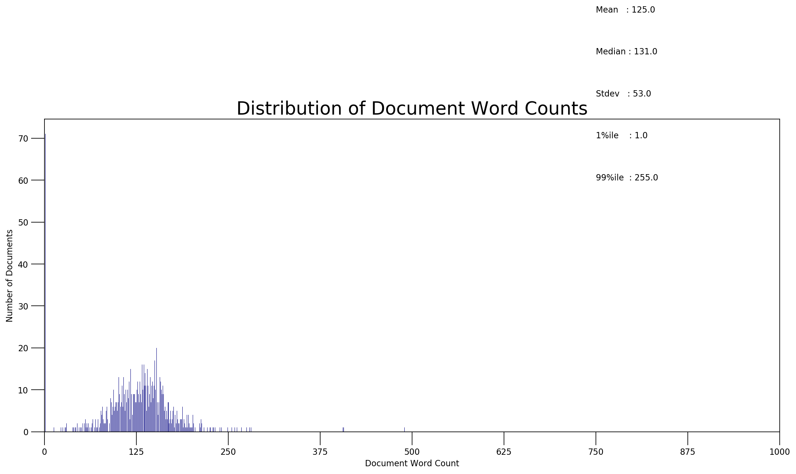
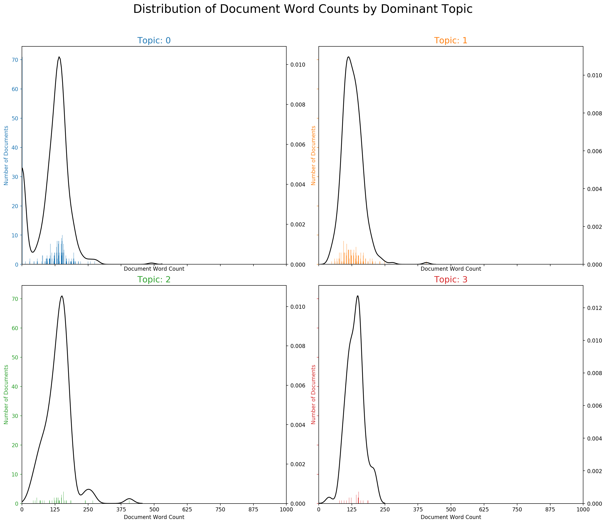
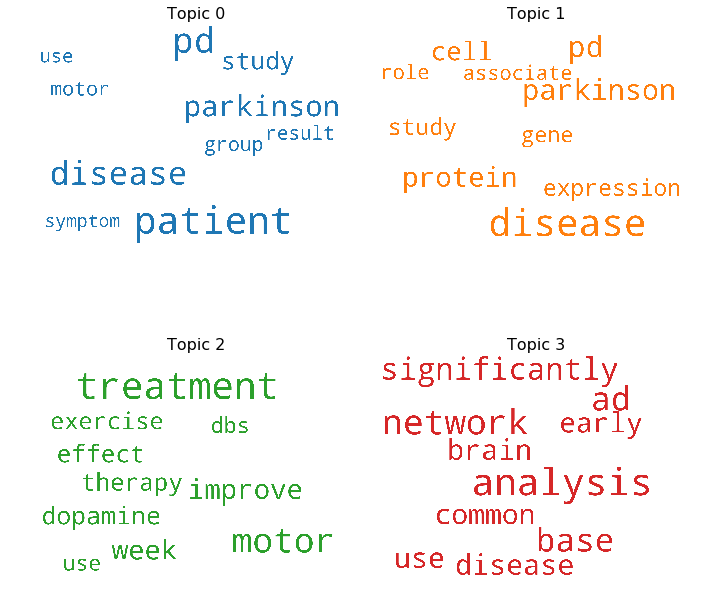
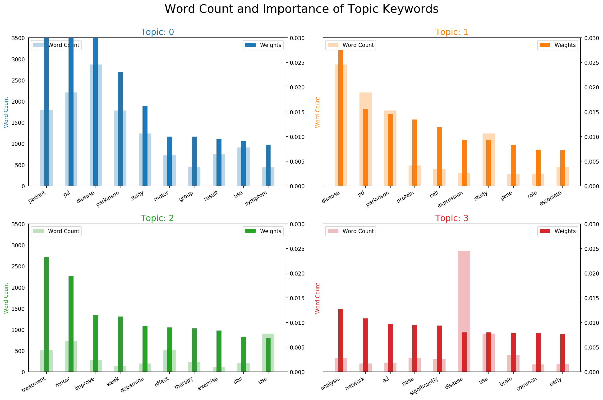
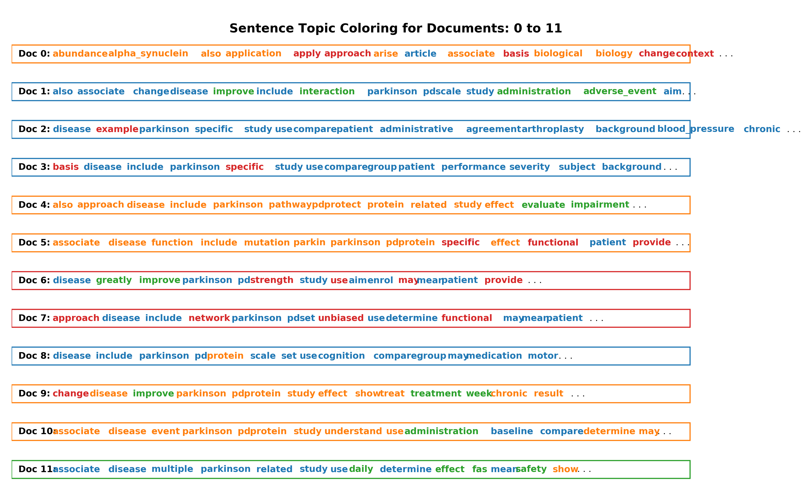
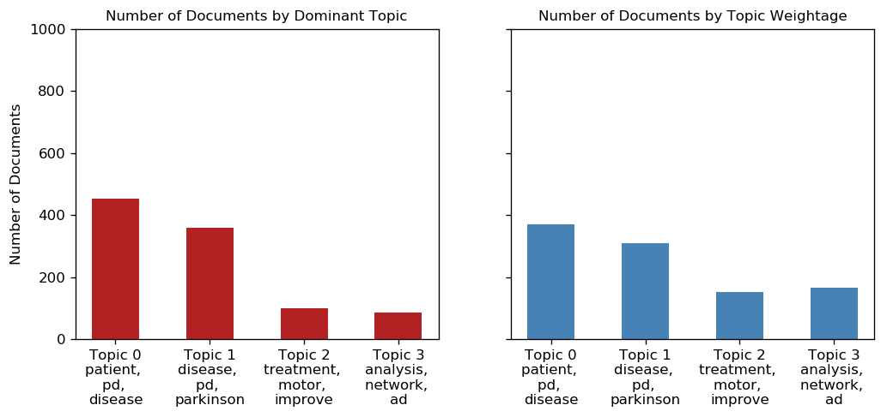

# Biomedical Text Analytics
### Author: Anoushkrit Goel 

## Importing the Libraries


```python
""" Created on 4 April 2019,
Modified on 26 April 2019

@Author: Anoushkrit Goel 
"""
!pip install syspath
import sys
!pip install re2
import re
import numpy as np

!pip install pprint 
from pprint import pprint
import pandas as pd
# Bio
!pip install biopython
!pip install bio
from Bio import Entrez, Medline


# Gensim
!pip install gensim 
import gensim
import gensim.corpora as corpora 
from gensim.utils import simple_preprocess

from gensim.models import CoherenceModel # Coherence Model may not be used

# spacy for Lemmatization
!pip install spacy
!python -m spacy download en
import spacy

#Plotting Tools
!pip install pyLDAvis
import pyLDAvis 
import pyLDAvis.gensim #crucial step 
import matplotlib.pyplot as plt
%matplotlib inline

!pip install seaborn
import seaborn as sns
import matplotlib.colors as mcolors
from matplotlib.ticker import FuncFormatter

# Network Visualisation 
!pip install networkx
import networkx as nx

#Quality Analysis and Testing Purposes
!pip install logging 
import logging
logging.basicConfig(format='%(asctime)s : %(levelname)s : %(message)s', level=logging.ERROR)

!pip install pytest-warnings
import warnings
warnings.filterwarnings("ignore", category=DeprecationWarning)

# File Conversion 
!pip install python-csv
!pip install jsonlib

import csv
import json
!pip install collections-extended
from collections import Counter
from collections import defaultdict

# Email for PubMed Verification 
Entrez.email = "anoushkritgoel@gmail.com"
```

    Requirement already satisfied: syspath in d:\programdata\anaconda3\lib\site-packages (1.1.0)
    Collecting re2
      Using cached https://files.pythonhosted.org/packages/14/b0/e3476ed13e60fc7fb0d172926809c53be7a8d02f14191ada449a6d572dcb/re2-0.2.24.tar.gz
    Building wheels for collected packages: re2
      Building wheel for re2 (setup.py): started
      Building wheel for re2 (setup.py): finished with status 'error'
      Complete output from command D:\ProgramData\Anaconda3\python.exe -u -c "import setuptools, tokenize;__file__='C:\\Users\\AnG\\AppData\\Local\\Temp\\pip-install-jp0g7hql\\re2\\setup.py';f=getattr(tokenize, 'open', open)(__file__);code=f.read().replace('\r\n', '\n');f.close();exec(compile(code, __file__, 'exec'))" bdist_wheel -d C:\Users\AnG\AppData\Local\Temp\pip-wheel-2qvcabfb --python-tag cp36:
      running bdist_wheel
      running build
      running build_ext
      building 're2' extension
      error: Microsoft Visual C++ 14.0 is required. Get it with "Microsoft Visual C++ Build Tools": https://visualstudio.microsoft.com/downloads/
      
      ----------------------------------------
      Running setup.py clean for re2
    Failed to build re2
    Installing collected packages: re2
      Running setup.py install for re2: started
        Running setup.py install for re2: finished with status 'error'
        Complete output from command D:\ProgramData\Anaconda3\python.exe -u -c "import setuptools, tokenize;__file__='C:\\Users\\AnG\\AppData\\Local\\Temp\\pip-install-jp0g7hql\\re2\\setup.py';f=getattr(tokenize, 'open', open)(__file__);code=f.read().replace('\r\n', '\n');f.close();exec(compile(code, __file__, 'exec'))" install --record C:\Users\AnG\AppData\Local\Temp\pip-record-2qf6infm\install-record.txt --single-version-externally-managed --compile:
        running install
        running build
        running build_ext
        building 're2' extension
        error: Microsoft Visual C++ 14.0 is required. Get it with "Microsoft Visual C++ Build Tools": https://visualstudio.microsoft.com/downloads/
        
        ----------------------------------------
    

      Failed building wheel for re2
    Command "D:\ProgramData\Anaconda3\python.exe -u -c "import setuptools, tokenize;__file__='C:\\Users\\AnG\\AppData\\Local\\Temp\\pip-install-jp0g7hql\\re2\\setup.py';f=getattr(tokenize, 'open', open)(__file__);code=f.read().replace('\r\n', '\n');f.close();exec(compile(code, __file__, 'exec'))" install --record C:\Users\AnG\AppData\Local\Temp\pip-record-2qf6infm\install-record.txt --single-version-externally-managed --compile" failed with error code 1 in C:\Users\AnG\AppData\Local\Temp\pip-install-jp0g7hql\re2\
    

    Requirement already satisfied: pprint in d:\programdata\anaconda3\lib\site-packages (0.1)
    Requirement already satisfied: biopython in d:\programdata\anaconda3\lib\site-packages (1.72)
    Requirement already satisfied: numpy in d:\programdata\anaconda3\lib\site-packages (from biopython) (1.16.3)
    Requirement already satisfied: bio in d:\programdata\anaconda3\lib\site-packages (0.1.0)
    Requirement already satisfied: gensim in d:\programdata\anaconda3\lib\site-packages (3.7.2)
    Requirement already satisfied: six>=1.5.0 in d:\programdata\anaconda3\lib\site-packages (from gensim) (1.12.0)
    Requirement already satisfied: smart-open>=1.7.0 in d:\programdata\anaconda3\lib\site-packages (from gensim) (1.8.2)
    Requirement already satisfied: numpy>=1.11.3 in d:\programdata\anaconda3\lib\site-packages (from gensim) (1.16.3)
    Requirement already satisfied: scipy>=0.18.1 in d:\programdata\anaconda3\lib\site-packages (from gensim) (1.2.1)
    Requirement already satisfied: boto>=2.32 in d:\programdata\anaconda3\lib\site-packages (from smart-open>=1.7.0->gensim) (2.48.0)
    Requirement already satisfied: boto3 in d:\programdata\anaconda3\lib\site-packages (from smart-open>=1.7.0->gensim) (1.9.134)
    Requirement already satisfied: requests in d:\programdata\anaconda3\lib\site-packages (from smart-open>=1.7.0->gensim) (2.21.0)
    Requirement already satisfied: bz2file in d:\programdata\anaconda3\lib\site-packages (from smart-open>=1.7.0->gensim) (0.98)
    Requirement already satisfied: jmespath<1.0.0,>=0.7.1 in d:\programdata\anaconda3\lib\site-packages (from boto3->smart-open>=1.7.0->gensim) (0.9.4)
    Requirement already satisfied: s3transfer<0.3.0,>=0.2.0 in d:\programdata\anaconda3\lib\site-packages (from boto3->smart-open>=1.7.0->gensim) (0.2.0)
    Requirement already satisfied: botocore<1.13.0,>=1.12.134 in d:\programdata\anaconda3\lib\site-packages (from boto3->smart-open>=1.7.0->gensim) (1.12.134)
    Requirement already satisfied: idna<2.9,>=2.5 in d:\programdata\anaconda3\lib\site-packages (from requests->smart-open>=1.7.0->gensim) (2.8)
    Requirement already satisfied: certifi>=2017.4.17 in d:\programdata\anaconda3\lib\site-packages (from requests->smart-open>=1.7.0->gensim) (2019.3.9)
    Requirement already satisfied: chardet<3.1.0,>=3.0.2 in d:\programdata\anaconda3\lib\site-packages (from requests->smart-open>=1.7.0->gensim) (3.0.4)
    Requirement already satisfied: urllib3<1.25,>=1.21.1 in d:\programdata\anaconda3\lib\site-packages (from requests->smart-open>=1.7.0->gensim) (1.24.1)
    Requirement already satisfied: python-dateutil<3.0.0,>=2.1; python_version >= "2.7" in d:\programdata\anaconda3\lib\site-packages (from botocore<1.13.0,>=1.12.134->boto3->smart-open>=1.7.0->gensim) (2.8.0)
    Requirement already satisfied: docutils>=0.10 in d:\programdata\anaconda3\lib\site-packages (from botocore<1.13.0,>=1.12.134->boto3->smart-open>=1.7.0->gensim) (0.14)
    Requirement already satisfied: spacy in d:\programdata\anaconda3\lib\site-packages (2.1.3)
    Requirement already satisfied: preshed<2.1.0,>=2.0.1 in d:\programdata\anaconda3\lib\site-packages (from spacy) (2.0.1)
    Requirement already satisfied: wasabi<1.1.0,>=0.2.0 in d:\programdata\anaconda3\lib\site-packages (from spacy) (0.2.1)
    Requirement already satisfied: numpy>=1.15.0 in d:\programdata\anaconda3\lib\site-packages (from spacy) (1.16.3)
    Requirement already satisfied: blis<0.3.0,>=0.2.2 in d:\programdata\anaconda3\lib\site-packages (from spacy) (0.2.4)
    Requirement already satisfied: cymem<2.1.0,>=2.0.2 in d:\programdata\anaconda3\lib\site-packages (from spacy) (2.0.2)
    Requirement already satisfied: murmurhash<1.1.0,>=0.28.0 in d:\programdata\anaconda3\lib\site-packages (from spacy) (1.0.2)
    Requirement already satisfied: plac<1.0.0,>=0.9.6 in d:\programdata\anaconda3\lib\site-packages (from spacy) (0.9.6)
    Requirement already satisfied: srsly<1.1.0,>=0.0.5 in d:\programdata\anaconda3\lib\site-packages (from spacy) (0.0.5)
    Requirement already satisfied: requests<3.0.0,>=2.13.0 in d:\programdata\anaconda3\lib\site-packages (from spacy) (2.21.0)
    Requirement already satisfied: jsonschema<3.0.0,>=2.6.0 in d:\programdata\anaconda3\lib\site-packages (from spacy) (2.6.0)
    Requirement already satisfied: thinc<7.1.0,>=7.0.2 in d:\programdata\anaconda3\lib\site-packages (from spacy) (7.0.4)
    Requirement already satisfied: idna<2.9,>=2.5 in d:\programdata\anaconda3\lib\site-packages (from requests<3.0.0,>=2.13.0->spacy) (2.8)
    Requirement already satisfied: certifi>=2017.4.17 in d:\programdata\anaconda3\lib\site-packages (from requests<3.0.0,>=2.13.0->spacy) (2019.3.9)
    Requirement already satisfied: chardet<3.1.0,>=3.0.2 in d:\programdata\anaconda3\lib\site-packages (from requests<3.0.0,>=2.13.0->spacy) (3.0.4)
    Requirement already satisfied: urllib3<1.25,>=1.21.1 in d:\programdata\anaconda3\lib\site-packages (from requests<3.0.0,>=2.13.0->spacy) (1.24.1)
    Requirement already satisfied: tqdm<5.0.0,>=4.10.0 in d:\programdata\anaconda3\lib\site-packages (from thinc<7.1.0,>=7.0.2->spacy) (4.31.1)
    Requirement already satisfied: en_core_web_sm==2.1.0 from https://github.com/explosion/spacy-models/releases/download/en_core_web_sm-2.1.0/en_core_web_sm-2.1.0.tar.gz#egg=en_core_web_sm==2.1.0 in d:\programdata\anaconda3\lib\site-packages (2.1.0)
    [+] Download and installation successful
    You can now load the model via spacy.load('en_core_web_sm')
    symbolic link created for D:\ProgramData\Anaconda3\lib\site-packages\spacy\data\en <<===>> D:\ProgramData\Anaconda3\lib\site-packages\en_core_web_sm
    [+] Linking successful
    D:\ProgramData\Anaconda3\lib\site-packages\en_core_web_sm -->
    D:\ProgramData\Anaconda3\lib\site-packages\spacy\data\en
    You can now load the model via spacy.load('en')
    Requirement already satisfied: pyLDAvis in d:\programdata\anaconda3\lib\site-packages (2.1.2)
    Requirement already satisfied: wheel>=0.23.0 in d:\programdata\anaconda3\lib\site-packages (from pyLDAvis) (0.33.1)
    Requirement already satisfied: numpy>=1.9.2 in d:\programdata\anaconda3\lib\site-packages (from pyLDAvis) (1.16.3)
    Requirement already satisfied: scipy>=0.18.0 in d:\programdata\anaconda3\lib\site-packages (from pyLDAvis) (1.2.1)
    Requirement already satisfied: pandas>=0.17.0 in d:\programdata\anaconda3\lib\site-packages (from pyLDAvis) (0.24.2)
    Requirement already satisfied: joblib>=0.8.4 in d:\programdata\anaconda3\lib\site-packages (from pyLDAvis) (0.13.2)
    Requirement already satisfied: jinja2>=2.7.2 in d:\programdata\anaconda3\lib\site-packages (from pyLDAvis) (2.10.1)
    Requirement already satisfied: numexpr in d:\programdata\anaconda3\lib\site-packages (from pyLDAvis) (2.6.9)
    Requirement already satisfied: pytest in d:\programdata\anaconda3\lib\site-packages (from pyLDAvis) (3.3.2)
    Requirement already satisfied: future in d:\programdata\anaconda3\lib\site-packages (from pyLDAvis) (0.17.1)
    Requirement already satisfied: funcy in d:\programdata\anaconda3\lib\site-packages (from pyLDAvis) (1.12)
    Requirement already satisfied: python-dateutil>=2.5.0 in d:\programdata\anaconda3\lib\site-packages (from pandas>=0.17.0->pyLDAvis) (2.8.0)
    Requirement already satisfied: pytz>=2011k in d:\programdata\anaconda3\lib\site-packages (from pandas>=0.17.0->pyLDAvis) (2019.1)
    Requirement already satisfied: MarkupSafe>=0.23 in d:\programdata\anaconda3\lib\site-packages (from jinja2>=2.7.2->pyLDAvis) (1.1.1)
    Requirement already satisfied: py>=1.5.0 in d:\programdata\anaconda3\lib\site-packages (from pytest->pyLDAvis) (1.5.2)
    Requirement already satisfied: six>=1.10.0 in d:\programdata\anaconda3\lib\site-packages (from pytest->pyLDAvis) (1.12.0)
    Requirement already satisfied: setuptools in d:\programdata\anaconda3\lib\site-packages (from pytest->pyLDAvis) (41.0.0)
    Requirement already satisfied: attrs>=17.2.0 in d:\programdata\anaconda3\lib\site-packages (from pytest->pyLDAvis) (19.1.0)
    Requirement already satisfied: pluggy<0.7,>=0.5 in d:\programdata\anaconda3\lib\site-packages (from pytest->pyLDAvis) (0.6.0)
    Requirement already satisfied: colorama in d:\programdata\anaconda3\lib\site-packages (from pytest->pyLDAvis) (0.4.1)
    

    d:\programdata\anaconda3\lib\site-packages\_pytest\fixtures.py:844: DeprecationWarning: The `convert` argument is deprecated in favor of `converter`.  It will be removed after 2019/01.
      params = attr.ib(convert=attr.converters.optional(tuple))
    d:\programdata\anaconda3\lib\site-packages\_pytest\fixtures.py:846: DeprecationWarning: The `convert` argument is deprecated in favor of `converter`.  It will be removed after 2019/01.
      ids = attr.ib(default=None, convert=_ensure_immutable_ids)
    

    Requirement already satisfied: seaborn in d:\programdata\anaconda3\lib\site-packages (0.8.1)
    Requirement already satisfied: numpy in d:\programdata\anaconda3\lib\site-packages (from seaborn) (1.16.3)
    Requirement already satisfied: scipy in d:\programdata\anaconda3\lib\site-packages (from seaborn) (1.2.1)
    Requirement already satisfied: matplotlib in d:\programdata\anaconda3\lib\site-packages (from seaborn) (3.0.3)
    Requirement already satisfied: pandas in d:\programdata\anaconda3\lib\site-packages (from seaborn) (0.24.2)
    Requirement already satisfied: cycler>=0.10 in d:\programdata\anaconda3\lib\site-packages (from matplotlib->seaborn) (0.10.0)
    Requirement already satisfied: kiwisolver>=1.0.1 in d:\programdata\anaconda3\lib\site-packages (from matplotlib->seaborn) (1.0.1)
    Requirement already satisfied: pyparsing!=2.0.4,!=2.1.2,!=2.1.6,>=2.0.1 in d:\programdata\anaconda3\lib\site-packages (from matplotlib->seaborn) (2.4.0)
    Requirement already satisfied: python-dateutil>=2.1 in d:\programdata\anaconda3\lib\site-packages (from matplotlib->seaborn) (2.8.0)
    Requirement already satisfied: pytz>=2011k in d:\programdata\anaconda3\lib\site-packages (from pandas->seaborn) (2019.1)
    Requirement already satisfied: six in d:\programdata\anaconda3\lib\site-packages (from cycler>=0.10->matplotlib->seaborn) (1.12.0)
    Requirement already satisfied: setuptools in d:\programdata\anaconda3\lib\site-packages (from kiwisolver>=1.0.1->matplotlib->seaborn) (41.0.0)
    Requirement already satisfied: networkx in d:\programdata\anaconda3\lib\site-packages (2.3)
    Requirement already satisfied: decorator>=4.3.0 in d:\programdata\anaconda3\lib\site-packages (from networkx) (4.4.0)
    Collecting logging
      Using cached https://files.pythonhosted.org/packages/93/4b/979db9e44be09f71e85c9c8cfc42f258adfb7d93ce01deed2788b2948919/logging-0.4.9.6.tar.gz
        Complete output from command python setup.py egg_info:
        running egg_info
        creating pip-egg-info\logging.egg-info
        writing pip-egg-info\logging.egg-info\PKG-INFO
        writing dependency_links to pip-egg-info\logging.egg-info\dependency_links.txt
        writing top-level names to pip-egg-info\logging.egg-info\top_level.txt
        writing manifest file 'pip-egg-info\logging.egg-info\SOURCES.txt'
        Traceback (most recent call last):
          File "<string>", line 1, in <module>
          File "C:\Users\AnG\AppData\Local\Temp\pip-install-vs33bf2j\logging\setup.py", line 13, in <module>
            packages = ["logging"],
          File "D:\ProgramData\Anaconda3\lib\distutils\core.py", line 148, in setup
            dist.run_commands()
          File "D:\ProgramData\Anaconda3\lib\distutils\dist.py", line 955, in run_commands
            self.run_command(cmd)
          File "D:\ProgramData\Anaconda3\lib\distutils\dist.py", line 974, in run_command
            cmd_obj.run()
          File "D:\ProgramData\Anaconda3\lib\site-packages\setuptools\command\egg_info.py", line 296, in run
            self.find_sources()
          File "D:\ProgramData\Anaconda3\lib\site-packages\setuptools\command\egg_info.py", line 303, in find_sources
            mm.run()
          File "D:\ProgramData\Anaconda3\lib\site-packages\setuptools\command\egg_info.py", line 534, in run
            self.add_defaults()
          File "D:\ProgramData\Anaconda3\lib\site-packages\setuptools\command\egg_info.py", line 570, in add_defaults
            sdist.add_defaults(self)
          File "D:\ProgramData\Anaconda3\lib\site-packages\setuptools\command\py36compat.py", line 34, in add_defaults
            self._add_defaults_python()
          File "D:\ProgramData\Anaconda3\lib\site-packages\setuptools\command\sdist.py", line 127, in _add_defaults_python
            build_py = self.get_finalized_command('build_py')
          File "D:\ProgramData\Anaconda3\lib\distutils\cmd.py", line 298, in get_finalized_command
            cmd_obj = self.distribution.get_command_obj(command, create)
          File "D:\ProgramData\Anaconda3\lib\distutils\dist.py", line 846, in get_command_obj
            klass = self.get_command_class(command)
          File "D:\ProgramData\Anaconda3\lib\site-packages\setuptools\dist.py", line 838, in get_command_class
            self.cmdclass[command] = cmdclass = ep.load()
          File "D:\ProgramData\Anaconda3\lib\site-packages\pkg_resources\__init__.py", line 2434, in load
            return self.resolve()
          File "D:\ProgramData\Anaconda3\lib\site-packages\pkg_resources\__init__.py", line 2440, in resolve
            module = __import__(self.module_name, fromlist=['__name__'], level=0)
          File "D:\ProgramData\Anaconda3\lib\site-packages\setuptools\command\build_py.py", line 15, in <module>
            from setuptools.lib2to3_ex import Mixin2to3
          File "D:\ProgramData\Anaconda3\lib\site-packages\setuptools\lib2to3_ex.py", line 12, in <module>
            from lib2to3.refactor import RefactoringTool, get_fixers_from_package
          File "D:\ProgramData\Anaconda3\lib\lib2to3\refactor.py", line 17, in <module>
            import logging
          File "C:\Users\AnG\AppData\Local\Temp\pip-install-vs33bf2j\logging\logging\__init__.py", line 618
            raise NotImplementedError, 'emit must be implemented '\
                                     ^
        SyntaxError: invalid syntax
        
        ----------------------------------------
    

    Command "python setup.py egg_info" failed with error code 1 in C:\Users\AnG\AppData\Local\Temp\pip-install-vs33bf2j\logging\
    

    Collecting pytest-warnings
      Downloading https://files.pythonhosted.org/packages/49/09/e464b757c7d5b75b369f2b3e24f3295eedb782919448a49e0e072c5102f7/pytest-warnings-0.3.0.tar.gz
    Requirement already satisfied: pytest in d:\programdata\anaconda3\lib\site-packages (from pytest-warnings) (3.3.2)
    Requirement already satisfied: py>=1.5.0 in d:\programdata\anaconda3\lib\site-packages (from pytest->pytest-warnings) (1.5.2)
    Requirement already satisfied: six>=1.10.0 in d:\programdata\anaconda3\lib\site-packages (from pytest->pytest-warnings) (1.12.0)
    Requirement already satisfied: setuptools in d:\programdata\anaconda3\lib\site-packages (from pytest->pytest-warnings) (41.0.0)
    Requirement already satisfied: attrs>=17.2.0 in d:\programdata\anaconda3\lib\site-packages (from pytest->pytest-warnings) (19.1.0)
    Requirement already satisfied: pluggy<0.7,>=0.5 in d:\programdata\anaconda3\lib\site-packages (from pytest->pytest-warnings) (0.6.0)
    Requirement already satisfied: colorama in d:\programdata\anaconda3\lib\site-packages (from pytest->pytest-warnings) (0.4.1)
    Building wheels for collected packages: pytest-warnings
      Building wheel for pytest-warnings (setup.py): started
      Building wheel for pytest-warnings (setup.py): finished with status 'done'
      Stored in directory: C:\Users\AnG\AppData\Local\pip\Cache\wheels\49\ec\1f\080fddfce012ef1e7e3345edbf186d315055b2108577b104a8
    Successfully built pytest-warnings
    Installing collected packages: pytest-warnings
    Successfully installed pytest-warnings-0.3.0
    Collecting python-csv
      Downloading https://files.pythonhosted.org/packages/a5/dc/7d044beccf6d10748ff5ad005441897e84265dea9aea9b39885758cc47fc/python-csv-0.0.11.tar.gz
    Collecting argparse (from python-csv)
      Downloading https://files.pythonhosted.org/packages/f2/94/3af39d34be01a24a6e65433d19e107099374224905f1e0cc6bbe1fd22a2f/argparse-1.4.0-py2.py3-none-any.whl
    Requirement already satisfied: numpy in d:\programdata\anaconda3\lib\site-packages (from python-csv) (1.16.3)
    Requirement already satisfied: pandas in d:\programdata\anaconda3\lib\site-packages (from python-csv) (0.24.2)
    Requirement already satisfied: matplotlib in d:\programdata\anaconda3\lib\site-packages (from python-csv) (3.0.3)
    Requirement already satisfied: xlrd in d:\programdata\anaconda3\lib\site-packages (from python-csv) (1.2.0)
    Collecting xmltodict (from python-csv)
      Downloading https://files.pythonhosted.org/packages/28/fd/30d5c1d3ac29ce229f6bdc40bbc20b28f716e8b363140c26eff19122d8a5/xmltodict-0.12.0-py2.py3-none-any.whl
    Collecting demjson (from python-csv)
      Downloading https://files.pythonhosted.org/packages/96/67/6db789e2533158963d4af689f961b644ddd9200615b8ce92d6cad695c65a/demjson-2.2.4.tar.gz (131kB)
    Collecting leven (from python-csv)
      Downloading https://files.pythonhosted.org/packages/73/02/37084115516cfd595ee2f9a873fffe8b85c6b1538523ff6a8b8dd7ff7d46/leven-1.0.4.tar.gz
    Collecting jtutils (from python-csv)
      Downloading https://files.pythonhosted.org/packages/e7/66/e17c5c7cf390e4b45c2ffc2adb3ad6e575ab0ff0bc647061f43c6fb2001e/jtutils-0.0.6.tar.gz
    Requirement already satisfied: pytz>=2011k in d:\programdata\anaconda3\lib\site-packages (from pandas->python-csv) (2019.1)
    Requirement already satisfied: python-dateutil>=2.5.0 in d:\programdata\anaconda3\lib\site-packages (from pandas->python-csv) (2.8.0)
    Requirement already satisfied: cycler>=0.10 in d:\programdata\anaconda3\lib\site-packages (from matplotlib->python-csv) (0.10.0)
    Requirement already satisfied: kiwisolver>=1.0.1 in d:\programdata\anaconda3\lib\site-packages (from matplotlib->python-csv) (1.0.1)
    Requirement already satisfied: pyparsing!=2.0.4,!=2.1.2,!=2.1.6,>=2.0.1 in d:\programdata\anaconda3\lib\site-packages (from matplotlib->python-csv) (2.4.0)
    Requirement already satisfied: six in d:\programdata\anaconda3\lib\site-packages (from leven->python-csv) (1.12.0)
    Requirement already satisfied: nose in d:\programdata\anaconda3\lib\site-packages (from leven->python-csv) (1.3.7)
    Requirement already satisfied: requests in d:\programdata\anaconda3\lib\site-packages (from jtutils->python-csv) (2.21.0)
    Requirement already satisfied: beautifulsoup4 in d:\programdata\anaconda3\lib\site-packages (from jtutils->python-csv) (4.7.1)
    Requirement already satisfied: setuptools in d:\programdata\anaconda3\lib\site-packages (from kiwisolver>=1.0.1->matplotlib->python-csv) (41.0.0)
    Requirement already satisfied: idna<2.9,>=2.5 in d:\programdata\anaconda3\lib\site-packages (from requests->jtutils->python-csv) (2.8)
    Requirement already satisfied: chardet<3.1.0,>=3.0.2 in d:\programdata\anaconda3\lib\site-packages (from requests->jtutils->python-csv) (3.0.4)
    Requirement already satisfied: certifi>=2017.4.17 in d:\programdata\anaconda3\lib\site-packages (from requests->jtutils->python-csv) (2019.3.9)
    Requirement already satisfied: urllib3<1.25,>=1.21.1 in d:\programdata\anaconda3\lib\site-packages (from requests->jtutils->python-csv) (1.24.1)
    Requirement already satisfied: soupsieve>=1.2 in d:\programdata\anaconda3\lib\site-packages (from beautifulsoup4->jtutils->python-csv) (1.8)
    Building wheels for collected packages: python-csv, demjson, leven, jtutils
      Building wheel for python-csv (setup.py): started
      Building wheel for python-csv (setup.py): finished with status 'done'
      Stored in directory: C:\Users\AnG\AppData\Local\pip\Cache\wheels\eb\b1\ad\62414185ac29c10d529af3e285759d5d8c54e4d84d84eac337
      Building wheel for demjson (setup.py): started
      Building wheel for demjson (setup.py): finished with status 'done'
      Stored in directory: C:\Users\AnG\AppData\Local\pip\Cache\wheels\c5\d2\ab\a54fb5ea53ac3badba098160e8452fa126a51febda80440ded
      Building wheel for leven (setup.py): started
      Building wheel for leven (setup.py): finished with status 'error'
      Complete output from command D:\ProgramData\Anaconda3\python.exe -u -c "import setuptools, tokenize;__file__='C:\\Users\\AnG\\AppData\\Local\\Temp\\pip-install-oszdf_ql\\leven\\setup.py';f=getattr(tokenize, 'open', open)(__file__);code=f.read().replace('\r\n', '\n');f.close();exec(compile(code, __file__, 'exec'))" bdist_wheel -d C:\Users\AnG\AppData\Local\Temp\pip-wheel-ikm46dll --python-tag cp36:
      running bdist_wheel
      running build
      running build_py
      creating build
      creating build\lib.win-amd64-3.6
      creating build\lib.win-amd64-3.6\leven
      copying leven\__init__.py -> build\lib.win-amd64-3.6\leven
      running build_ext
      building 'leven._levenshtein' extension
      error: Microsoft Visual C++ 14.0 is required. Get it with "Microsoft Visual C++ Build Tools": https://visualstudio.microsoft.com/downloads/
      
      ----------------------------------------
      Running setup.py clean for leven
      Building wheel for jtutils (setup.py): started
      Building wheel for jtutils (setup.py): finished with status 'done'
      Stored in directory: C:\Users\AnG\AppData\Local\pip\Cache\wheels\ce\7d\63\cac19c4c7c0d765c7916d80e277e6bcf0cae070758fc5b6496
    Successfully built python-csv demjson jtutils
    Failed to build leven
    Installing collected packages: argparse, xmltodict, demjson, leven, jtutils, python-csv
      Running setup.py install for leven: started
        Running setup.py install for leven: finished with status 'error'
        Complete output from command D:\ProgramData\Anaconda3\python.exe -u -c "import setuptools, tokenize;__file__='C:\\Users\\AnG\\AppData\\Local\\Temp\\pip-install-oszdf_ql\\leven\\setup.py';f=getattr(tokenize, 'open', open)(__file__);code=f.read().replace('\r\n', '\n');f.close();exec(compile(code, __file__, 'exec'))" install --record C:\Users\AnG\AppData\Local\Temp\pip-record-djxult_l\install-record.txt --single-version-externally-managed --compile:
        running install
        running build
        running build_py
        creating build
        creating build\lib.win-amd64-3.6
        creating build\lib.win-amd64-3.6\leven
        copying leven\__init__.py -> build\lib.win-amd64-3.6\leven
        running build_ext
        building 'leven._levenshtein' extension
        error: Microsoft Visual C++ 14.0 is required. Get it with "Microsoft Visual C++ Build Tools": https://visualstudio.microsoft.com/downloads/
        
        ----------------------------------------
    

      Failed building wheel for leven
    Command "D:\ProgramData\Anaconda3\python.exe -u -c "import setuptools, tokenize;__file__='C:\\Users\\AnG\\AppData\\Local\\Temp\\pip-install-oszdf_ql\\leven\\setup.py';f=getattr(tokenize, 'open', open)(__file__);code=f.read().replace('\r\n', '\n');f.close();exec(compile(code, __file__, 'exec'))" install --record C:\Users\AnG\AppData\Local\Temp\pip-record-djxult_l\install-record.txt --single-version-externally-managed --compile" failed with error code 1 in C:\Users\AnG\AppData\Local\Temp\pip-install-oszdf_ql\leven\
    

    Collecting jsonlib
      Downloading https://files.pythonhosted.org/packages/7c/55/19c29fd79dfb5d42f4568feedc5a286d01d0683a372c1e19024531576508/jsonlib-1.6.1.tar.gz (43kB)
    Building wheels for collected packages: jsonlib
      Building wheel for jsonlib (setup.py): started
      Building wheel for jsonlib (setup.py): finished with status 'error'
      Complete output from command D:\ProgramData\Anaconda3\python.exe -u -c "import setuptools, tokenize;__file__='C:\\Users\\AnG\\AppData\\Local\\Temp\\pip-install-drvaglow\\jsonlib\\setup.py';f=getattr(tokenize, 'open', open)(__file__);code=f.read().replace('\r\n', '\n');f.close();exec(compile(code, __file__, 'exec'))" bdist_wheel -d C:\Users\AnG\AppData\Local\Temp\pip-wheel-05f9j6zy --python-tag cp36:
      running bdist_wheel
      running build
      running build_py
      creating build
      creating build\lib.win-amd64-3.6
      copying jsonlib.py -> build\lib.win-amd64-3.6
      running build_ext
      building '_jsonlib' extension
      error: Microsoft Visual C++ 14.0 is required. Get it with "Microsoft Visual C++ Build Tools": https://visualstudio.microsoft.com/downloads/
      
      ----------------------------------------
      Running setup.py clean for jsonlib
    Failed to build jsonlib
    Installing collected packages: jsonlib
      Running setup.py install for jsonlib: started
        Running setup.py install for jsonlib: finished with status 'error'
        Complete output from command D:\ProgramData\Anaconda3\python.exe -u -c "import setuptools, tokenize;__file__='C:\\Users\\AnG\\AppData\\Local\\Temp\\pip-install-drvaglow\\jsonlib\\setup.py';f=getattr(tokenize, 'open', open)(__file__);code=f.read().replace('\r\n', '\n');f.close();exec(compile(code, __file__, 'exec'))" install --record C:\Users\AnG\AppData\Local\Temp\pip-record-1toymud7\install-record.txt --single-version-externally-managed --compile:
        running install
        running build
        running build_py
        creating build
        creating build\lib.win-amd64-3.6
        copying jsonlib.py -> build\lib.win-amd64-3.6
        running build_ext
        building '_jsonlib' extension
        error: Microsoft Visual C++ 14.0 is required. Get it with "Microsoft Visual C++ Build Tools": https://visualstudio.microsoft.com/downloads/
        
        ----------------------------------------
    

      Failed building wheel for jsonlib
    Command "D:\ProgramData\Anaconda3\python.exe -u -c "import setuptools, tokenize;__file__='C:\\Users\\AnG\\AppData\\Local\\Temp\\pip-install-drvaglow\\jsonlib\\setup.py';f=getattr(tokenize, 'open', open)(__file__);code=f.read().replace('\r\n', '\n');f.close();exec(compile(code, __file__, 'exec'))" install --record C:\Users\AnG\AppData\Local\Temp\pip-record-1toymud7\install-record.txt --single-version-externally-managed --compile" failed with error code 1 in C:\Users\AnG\AppData\Local\Temp\pip-install-drvaglow\jsonlib\
    

    Collecting collections-extended
      Downloading https://files.pythonhosted.org/packages/e6/bb/917ec8f030be3da7a4610f98dc6fc46a2d701433a1e6f82905f0cbd1be3f/collections_extended-1.0.2-py2.py3-none-any.whl
    Requirement already satisfied: setuptools in d:\programdata\anaconda3\lib\site-packages (from collections-extended) (41.0.0)
    Installing collected packages: collections-extended
    Successfully installed collections-extended-1.0.2
    

### Search Database
Function to search the respective database.


```python
def searchpubmed(return_max= None, database=None, searchqueryinput=None):
  print('Search' + database)
  if searchqueryinput:
    searchquery = searchqueryinput
  handle = Entrez.esearch(db=database, term=searchquery, retmax=return_max)  # retmax is 20 by esearch default
  queryresponse = Entrez.read(handle)
  handle.close()
  print("\n" + queryresponse['Count'] + " results available for \'" + str(searchquery) + "\', returning " + str(
        return_max))
  queryids = (searchquery, queryresponse['IdList'])
  return queryids
```

### Fetch Record


```python
def fetchrecord(inputids, numberofrecs, queryinput):
    print('Downloading Pubmed Records...')
    handle = Entrez.efetch(database, id=str(inputids), rettype="medline", retmode="text")
    records = Medline.parse(handle)
    records = list(records)
    recordsdf = pd.DataFrame(records)
    print('\nFeatures available: {}'.format(recordsdf.columns.values.tolist()))
    recordsdf['Searched'] = str(queryinput)
    reckeys = ['PMID', 'TI', 'AB', 'DP', 'PHST', 'Searched']
    print("\nReturning {} features : {} ".format((len(reckeys) - 1), reckeys[0:(len(reckeys) - 1)]))
    recordsselectdf = recordsdf[reckeys]
    
    recordsdf.to_json('full_records' + str(numberofrecs) + '.json')
    recordsselectdf.to_json('selected_records' + str(numberofrecs) + '.json')
    return recordsselectdf
```


```python
numberofrecs= input("Number of records?")
queryinput= input("Which disease you want to visualize?")
database = input("Which database to refer?")
inputids = searchpubmed(return_max=numberofrecs, database=database, searchqueryinput=queryinput)
fetchrecord(inputids, numberofrecs, queryinput)
```

    Number of records?1000
    Which disease you want to visualize?Parkinson's Disease
    Which database to refer?pubmed
    Searchpubmed
    
    104687 results available for 'Parkinson's Disease', returning 1000
    Downloading Pubmed Records...
    
    Features available: ['AB', 'AD', 'AID', 'AU', 'AUID', 'BTI', 'CDAT', 'CI', 'CN', 'COIS', 'CRDT', 'CTDT', 'CTI', 'DA', 'DCOM', 'DEP', 'DP', 'EDAT', 'EFR', 'EIN', 'FAU', 'FIR', 'GR', 'IP', 'IR', 'IS', 'JID', 'JT', 'LA', 'LID', 'LR', 'MH', 'MHDA', 'MID', 'OT', 'OTO', 'OWN', 'PB', 'PG', 'PHST', 'PL', 'PMC', 'PMCR', 'PMID', 'PST', 'PT', 'RN', 'SB', 'SI', 'SO', 'STAT', 'TA', 'TI', 'TT', 'UOF', 'VI']
    
    Returning 5 features : ['PMID', 'TI', 'AB', 'DP', 'PHST'] 
    


<div>
<style scoped>
    .dataframe tbody tr th:only-of-type {
        vertical-align: middle;
    }

    .dataframe tbody tr th {
        vertical-align: top;
    }

    .dataframe thead th {
        text-align: right;
    }
</style>
<table border="1" class="dataframe">
  <thead>
    <tr style="text-align: right;">
      <th></th>
      <th>PMID</th>
      <th>TI</th>
      <th>AB</th>
      <th>DP</th>
      <th>PHST</th>
      <th>Searched</th>
    </tr>
  </thead>
  <tbody>
    <tr>
      <th>0</th>
      <td>31022302</td>
      <td>Proteomics; applications in familial Parkinson...</td>
      <td>Our understanding of the biological basis of P...</td>
      <td>2019 Apr 25</td>
      <td>[2019/04/26 06:00 [entrez], 2019/04/26 06:00 [...</td>
      <td>Parkinson's Disease</td>
    </tr>
    <tr>
      <th>1</th>
      <td>31022213</td>
      <td>Safety and preliminary efficacy of intranasal ...</td>
      <td>Parkinson disease (PD) is associated with cogn...</td>
      <td>2019</td>
      <td>[2018/06/08 00:00 [received], 2019/03/12 00:00...</td>
      <td>Parkinson's Disease</td>
    </tr>
    <tr>
      <th>2</th>
      <td>31022188</td>
      <td>Necrosis, apoptosis, necroptosis, three modes ...</td>
      <td>Most of the Parkinson's disease (PD) cases are...</td>
      <td>2019</td>
      <td>[2018/10/25 00:00 [received], 2019/03/31 00:00...</td>
      <td>Parkinson's Disease</td>
    </tr>
    <tr>
      <th>3</th>
      <td>31021467</td>
      <td>Chronic renal dysfunction, proteinuria, and ri...</td>
      <td>BACKGROUND: The roles of chronic kidney diseas...</td>
      <td>2019 Apr 25</td>
      <td>[2018/11/13 00:00 [received], 2019/03/09 00:00...</td>
      <td>Parkinson's Disease</td>
    </tr>
    <tr>
      <th>4</th>
      <td>31021043</td>
      <td>Extensive validation study of the Parkinson's ...</td>
      <td>BACKGROUND: A composite instrument able to rap...</td>
      <td>2019 Apr 25</td>
      <td>[2019/04/26 06:00 [entrez], 2019/04/26 06:00 [...</td>
      <td>Parkinson's Disease</td>
    </tr>
    <tr>
      <th>5</th>
      <td>31020348</td>
      <td>Microglial histamine H4R in the pathophysiolog...</td>
      <td>NaN</td>
      <td>2019 Apr 24</td>
      <td>[2019/02/11 00:00 [received], 2019/02/14 00:00...</td>
      <td>Parkinson's Disease</td>
    </tr>
    <tr>
      <th>6</th>
      <td>31020003</td>
      <td>Plasma alpha-synuclein levels are increased in...</td>
      <td>Objective: Obstructive sleep apnea syndrome (O...</td>
      <td>2019 Apr</td>
      <td>[2018/11/14 00:00 [received], 2019/02/18 00:00...</td>
      <td>Parkinson's Disease</td>
    </tr>
    <tr>
      <th>7</th>
      <td>31019993</td>
      <td>Association of corneal nerve fiber measures wi...</td>
      <td>Objectives: Corneal confocal microscopy (CCM) ...</td>
      <td>2019 Apr</td>
      <td>[2019/01/28 00:00 [received], 2019/02/05 00:00...</td>
      <td>Parkinson's Disease</td>
    </tr>
    <tr>
      <th>8</th>
      <td>31019987</td>
      <td>Cardiovascular risk factors and Parkinson's di...</td>
      <td>Objective: The objectives of this study were t...</td>
      <td>2019 Apr</td>
      <td>[2018/11/30 00:00 [received], 2019/01/08 00:00...</td>
      <td>Parkinson's Disease</td>
    </tr>
    <tr>
      <th>9</th>
      <td>31019944</td>
      <td>Association between carotid plaque and Parkins...</td>
      <td>Background: Epidemiological studies show that ...</td>
      <td>2019 Mar</td>
      <td>[2019/04/26 06:00 [entrez], 2019/04/26 06:00 [...</td>
      <td>Parkinson's Disease</td>
    </tr>
    <tr>
      <th>10</th>
      <td>31018839</td>
      <td>The agreement between chronic diseases reporte...</td>
      <td>BACKGROUND: This study examined the agreement ...</td>
      <td>2019 Apr 24</td>
      <td>[2018/09/04 00:00 [received], 2019/04/10 00:00...</td>
      <td>Parkinson's Disease</td>
    </tr>
    <tr>
      <th>11</th>
      <td>31018181</td>
      <td>Objective assessment of blinking and facial ex...</td>
      <td>OBJECTIVE: Hypomimia is a common and early sym...</td>
      <td>2019 Apr 24</td>
      <td>[2019/04/25 06:00 [entrez], 2019/04/25 06:00 [...</td>
      <td>Parkinson's Disease</td>
    </tr>
    <tr>
      <th>12</th>
      <td>31018154</td>
      <td>Implications of the mitochondrial interactome ...</td>
      <td>Multiple thioredoxin isoforms exist in all liv...</td>
      <td>2019 Apr 21</td>
      <td>[2019/04/01 00:00 [received], 2019/04/15 00:00...</td>
      <td>Parkinson's Disease</td>
    </tr>
    <tr>
      <th>13</th>
      <td>31017288</td>
      <td>[Efficacy of virtual reality on balance and ga...</td>
      <td>INTRODUCTION: Multiple sclerosis (MS) is a neu...</td>
      <td>2019 May 1</td>
      <td>[2019/04/25 06:00 [entrez], 2019/04/25 06:00 [...</td>
      <td>Parkinson's Disease</td>
    </tr>
    <tr>
      <th>14</th>
      <td>31017259</td>
      <td>Global brain ischemia in rats is associated wi...</td>
      <td>Mitochondria are crucial for neuronal cell sur...</td>
      <td>2019 Jun</td>
      <td>[2018/10/19 00:00 [received], 2019/03/27 00:00...</td>
      <td>Parkinson's Disease</td>
    </tr>
    <tr>
      <th>15</th>
      <td>31017021</td>
      <td>Pharmacokinetics of monoamine oxidase B inhibi...</td>
      <td>INTRODUCTION: Brain function depends considera...</td>
      <td>2019 Apr 24</td>
      <td>[2019/04/25 06:00 [entrez], 2019/04/25 06:00 [...</td>
      <td>Parkinson's Disease</td>
    </tr>
    <tr>
      <th>16</th>
      <td>31016994</td>
      <td>Effect of virtual reality on balance and gait ...</td>
      <td>OBJECTIVE: The aim of this study was to evalua...</td>
      <td>2019 Apr 24</td>
      <td>[2019/04/25 06:00 [entrez], 2019/04/25 06:00 [...</td>
      <td>Parkinson's Disease</td>
    </tr>
    <tr>
      <th>17</th>
      <td>31016688</td>
      <td>Anti-inflammatory Activity of Ursolic Acid in ...</td>
      <td>Neuroinflammation plays an important role in t...</td>
      <td>2019 Apr 23</td>
      <td>[2019/01/19 00:00 [received], 2019/03/29 00:00...</td>
      <td>Parkinson's Disease</td>
    </tr>
    <tr>
      <th>18</th>
      <td>31016348</td>
      <td>Astrocyte alterations in neurodegenerative pat...</td>
      <td>Astrocytes are the most abundant cell type in ...</td>
      <td>2019 Apr 23</td>
      <td>[2018/12/29 00:00 [received], 2019/04/16 00:00...</td>
      <td>Parkinson's Disease</td>
    </tr>
    <tr>
      <th>19</th>
      <td>31016231</td>
      <td>Moving beyond neurons: the role of cell type-s...</td>
      <td>Parkinson's disease (PD), with its characteris...</td>
      <td>2019</td>
      <td>[2018/11/14 00:00 [received], 2019/02/28 00:00...</td>
      <td>Parkinson's Disease</td>
    </tr>
    <tr>
      <th>20</th>
      <td>31015727</td>
      <td>Focal stimulation of the sheep motor cortex wi...</td>
      <td>Direct electrical stimulation of the brain can...</td>
      <td>2018 Dec</td>
      <td>[2018/02/08 00:00 [received], 2018/10/22 00:00...</td>
      <td>Parkinson's Disease</td>
    </tr>
    <tr>
      <th>21</th>
      <td>31015544</td>
      <td>A novel wireless brain stimulation device for ...</td>
      <td>Deep brain stimulation (DBS) has been used in ...</td>
      <td>2019 Apr 23</td>
      <td>[2018/08/22 00:00 [received], 2019/04/08 00:00...</td>
      <td>Parkinson's Disease</td>
    </tr>
    <tr>
      <th>22</th>
      <td>31015149</td>
      <td>Clinical series of Parkinson's disease in KwaZ...</td>
      <td>BACKGROUND: There is limited data on Parkinson...</td>
      <td>2019 Mar 26</td>
      <td>[2018/10/26 00:00 [received], 2019/03/13 00:00...</td>
      <td>Parkinson's Disease</td>
    </tr>
    <tr>
      <th>23</th>
      <td>31013638</td>
      <td>Oxidative Stress: A Key Modulator in Neurodege...</td>
      <td>Oxidative stress is proposed as a regulatory e...</td>
      <td>2019 Apr 22</td>
      <td>[2019/02/28 00:00 [received], 2019/04/02 00:00...</td>
      <td>Parkinson's Disease</td>
    </tr>
    <tr>
      <th>24</th>
      <td>31011049</td>
      <td>A Pilot Study to Determine the Consistency of ...</td>
      <td>Wrist actigraphy is a form of objective sleep ...</td>
      <td>2017 Dec 27</td>
      <td>[2017/11/07 00:00 [received], 2017/12/24 00:00...</td>
      <td>Parkinson's Disease</td>
    </tr>
    <tr>
      <th>25</th>
      <td>31011027</td>
      <td>Fragility Fractures and Parkinsonism: Relation...</td>
      <td>Background: The risk of falls is higher in pat...</td>
      <td>2017 May 24</td>
      <td>[2017/03/23 00:00 [received], 2017/04/21 00:00...</td>
      <td>Parkinson's Disease</td>
    </tr>
    <tr>
      <th>26</th>
      <td>31011018</td>
      <td>Managing Ethical Dilemmas in End-Stage Neurode...</td>
      <td>Neurodegenerative diseases are chronic, progre...</td>
      <td>2017 Jan 20</td>
      <td>[2016/11/14 00:00 [received], 2017/01/05 00:00...</td>
      <td>Parkinson's Disease</td>
    </tr>
    <tr>
      <th>27</th>
      <td>31013498</td>
      <td>Cross-Sectional Area Analysis of the Head of t...</td>
      <td>BACKGROUND: Caudate nucleus atrophy is a well-...</td>
      <td>2019 Apr 23</td>
      <td>[2019/01/29 00:00 [received], 2019/03/22 00:00...</td>
      <td>Parkinson's Disease</td>
    </tr>
    <tr>
      <th>28</th>
      <td>31013340</td>
      <td>Assessment of cognitive profile as a prodromal...</td>
      <td>STUDY OBJECTIVES: To search for a specific neu...</td>
      <td>2019 Apr 23</td>
      <td>[2018/12/05 00:00 [received], 2019/04/24 06:00...</td>
      <td>Parkinson's Disease</td>
    </tr>
    <tr>
      <th>29</th>
      <td>31012437</td>
      <td>Impact of Parkinson's disease on the efficienc...</td>
      <td>BACKGROUND: This study evaluated the efficienc...</td>
      <td>2019 Apr 23</td>
      <td>[2018/10/29 00:00 [received], 2019/02/04 00:00...</td>
      <td>Parkinson's Disease</td>
    </tr>
    <tr>
      <th>...</th>
      <td>...</td>
      <td>...</td>
      <td>...</td>
      <td>...</td>
      <td>...</td>
      <td>...</td>
    </tr>
    <tr>
      <th>970</th>
      <td>30825602</td>
      <td>Contribution of cholinergic interneurons to st...</td>
      <td>Parkinson's disease (PD) is a neurodegenerativ...</td>
      <td>2019 Jun</td>
      <td>[2018/11/30 00:00 [received], 2019/01/25 00:00...</td>
      <td>Parkinson's Disease</td>
    </tr>
    <tr>
      <th>971</th>
      <td>30825547</td>
      <td>Anti-ageing and anti-Parkinsonian effects of n...</td>
      <td>Ageing is a progressive deterioration in funct...</td>
      <td>2019 Jun</td>
      <td>[2018/09/10 00:00 [received], 2019/01/12 00:00...</td>
      <td>Parkinson's Disease</td>
    </tr>
    <tr>
      <th>972</th>
      <td>30825442</td>
      <td>Central neuropeptide-S treatment improves neur...</td>
      <td>Parkinson's disease (PD) is characterized by d...</td>
      <td>2019 Feb 27</td>
      <td>[2018/08/14 00:00 [received], 2019/02/12 00:00...</td>
      <td>Parkinson's Disease</td>
    </tr>
    <tr>
      <th>973</th>
      <td>30825356</td>
      <td>Peripheral and central respiratory system path...</td>
      <td>NaN</td>
      <td>2019 Mar 2</td>
      <td>[2019/02/26 00:00 [received], 2019/02/28 00:00...</td>
      <td>Parkinson's Disease</td>
    </tr>
    <tr>
      <th>974</th>
      <td>30824768</td>
      <td>Prioritizing Parkinson's disease genes using p...</td>
      <td>Genome-wide association studies (GWAS) have id...</td>
      <td>2019 Mar 1</td>
      <td>[2018/04/16 00:00 [received], 2019/02/05 00:00...</td>
      <td>Parkinson's Disease</td>
    </tr>
    <tr>
      <th>975</th>
      <td>30824561</td>
      <td>Managing treatment fluctuations in Parkinson d...</td>
      <td>NaN</td>
      <td>2019 Mar 26</td>
      <td>[2019/03/03 06:00 [pubmed], 2019/03/03 06:00 [...</td>
      <td>Parkinson's Disease</td>
    </tr>
    <tr>
      <th>976</th>
      <td>30824559</td>
      <td>Increased dose of carbidopa with levodopa and ...</td>
      <td>OBJECTIVE: To investigate whether increased fi...</td>
      <td>2019 Mar 26</td>
      <td>[2018/02/27 00:00 [received], 2018/11/21 00:00...</td>
      <td>Parkinson's Disease</td>
    </tr>
    <tr>
      <th>977</th>
      <td>30824461</td>
      <td>Neuroleptic malignant syndrome as part of an a...</td>
      <td>A 65-year-old Japanese woman with Parkinson's ...</td>
      <td>2019 Feb 28</td>
      <td>[2019/03/03 06:00 [entrez], 2019/03/03 06:00 [...</td>
      <td>Parkinson's Disease</td>
    </tr>
    <tr>
      <th>978</th>
      <td>30824285</td>
      <td>The role of phosphodiesterase 4 in excessive d...</td>
      <td>INTRODUCTION: Preclinical studies suggest a li...</td>
      <td>2019 Feb 22</td>
      <td>[2018/09/14 00:00 [received], 2019/01/09 00:00...</td>
      <td>Parkinson's Disease</td>
    </tr>
    <tr>
      <th>979</th>
      <td>30824283</td>
      <td>Creativity related to dopaminergic treatment: ...</td>
      <td>Impulse control disorder (ICD), including path...</td>
      <td>2019 Feb 22</td>
      <td>[2018/09/19 00:00 [received], 2019/01/18 00:00...</td>
      <td>Parkinson's Disease</td>
    </tr>
    <tr>
      <th>980</th>
      <td>30824282</td>
      <td>Tandem gait abnormality in Parkinson disease: ...</td>
      <td>INTRODUCTION: We report the prevalence of abno...</td>
      <td>2019 Feb 23</td>
      <td>[2018/08/29 00:00 [received], 2019/02/18 00:00...</td>
      <td>Parkinson's Disease</td>
    </tr>
    <tr>
      <th>981</th>
      <td>30824206</td>
      <td>Photobiomodulation in Parkinson's disease: A r...</td>
      <td>NaN</td>
      <td>2019 Feb 20</td>
      <td>[2019/02/12 00:00 [received], 2019/02/14 00:00...</td>
      <td>Parkinson's Disease</td>
    </tr>
    <tr>
      <th>982</th>
      <td>30824180</td>
      <td>Neuropharmacological Insight from Allosteric M...</td>
      <td>The metabotropic glutamate (mGlu) receptors ar...</td>
      <td>2019 Apr</td>
      <td>[2019/01/11 00:00 [received], 2019/02/06 00:00...</td>
      <td>Parkinson's Disease</td>
    </tr>
    <tr>
      <th>983</th>
      <td>30823626</td>
      <td>1-O-Hexyl-2,3,5-Trimethylhydroquinone Ameliora...</td>
      <td>1-O-Hexyl-2,3,5-trimethylhydroquinone (HTHQ) h...</td>
      <td>2019 Mar 1</td>
      <td>[2019/02/14 00:00 [received], 2019/02/21 00:00...</td>
      <td>Parkinson's Disease</td>
    </tr>
    <tr>
      <th>984</th>
      <td>30823541</td>
      <td>Targeting the Iron-Response Elements of the mR...</td>
      <td>The therapeutic value of inhibiting translatio...</td>
      <td>2019 Feb 25</td>
      <td>[2019/01/13 00:00 [received], 2019/02/08 00:00...</td>
      <td>Parkinson's Disease</td>
    </tr>
    <tr>
      <th>985</th>
      <td>30822717</td>
      <td>Validations of apomorphine-induced BOLD activa...</td>
      <td>Identification of Parkinson's disease at the e...</td>
      <td>2019 Feb 18</td>
      <td>[2018/06/07 00:00 [received], 2019/02/08 00:00...</td>
      <td>Parkinson's Disease</td>
    </tr>
    <tr>
      <th>986</th>
      <td>30822711</td>
      <td>Discovery of arylbenzylamines as PDE4 inhibito...</td>
      <td>Growing evidence confirms the potential of PDE...</td>
      <td>2019 Apr 15</td>
      <td>[2018/12/18 00:00 [received], 2019/01/25 00:00...</td>
      <td>Parkinson's Disease</td>
    </tr>
    <tr>
      <th>987</th>
      <td>30822586</td>
      <td>Morphometric Study of the Internal Globus Pall...</td>
      <td>BACKGROUND: The globus pallidus internus (Gpi)...</td>
      <td>2019 Feb 26</td>
      <td>[2017/06/07 00:00 [received], 2019/02/13 00:00...</td>
      <td>Parkinson's Disease</td>
    </tr>
    <tr>
      <th>988</th>
      <td>30821649</td>
      <td>Telephone-Delivered Cognitive Behavioural Ther...</td>
      <td>OBJECTIVES: To determine the feasibility, acce...</td>
      <td>2019 Mar 1</td>
      <td>[2019/03/02 06:00 [pubmed], 2019/03/02 06:00 [...</td>
      <td>Parkinson's Disease</td>
    </tr>
    <tr>
      <th>989</th>
      <td>30821637</td>
      <td>Goal management training (R) home-based approa...</td>
      <td>Approximately 30% of patients with Parkinson's...</td>
      <td>2018 Oct - Dec</td>
      <td>[2019/03/02 06:00 [pubmed], 2019/03/02 06:00 [...</td>
      <td>Parkinson's Disease</td>
    </tr>
    <tr>
      <th>990</th>
      <td>30821607</td>
      <td>Down-regulated TMED10 in Alzheimer disease ind...</td>
      <td>Several studies have shown that dysfunction of...</td>
      <td>2019 Mar 1</td>
      <td>[2019/03/02 06:00 [pubmed], 2019/03/02 06:00 [...</td>
      <td>Parkinson's Disease</td>
    </tr>
    <tr>
      <th>991</th>
      <td>30821505</td>
      <td>Validity and reliability of the Persian versio...</td>
      <td>Parkinson's disease (PD) is a progressive mult...</td>
      <td>2019 Mar 1</td>
      <td>[2019/03/02 06:00 [pubmed], 2019/03/02 06:00 [...</td>
      <td>Parkinson's Disease</td>
    </tr>
    <tr>
      <th>992</th>
      <td>30820932</td>
      <td>Dyskinesia and FAB score predict future fallin...</td>
      <td>A growing body of research highlights the impo...</td>
      <td>2019 Mar 1</td>
      <td>[2018/11/03 00:00 [received], 2019/02/09 00:00...</td>
      <td>Parkinson's Disease</td>
    </tr>
    <tr>
      <th>993</th>
      <td>30820889</td>
      <td>Effects of Preventive Treadmill Exercise on th...</td>
      <td>Metabolic and mitochondrial dysfunction has be...</td>
      <td>2019 May</td>
      <td>[2018/10/24 00:00 [received], 2019/01/24 00:00...</td>
      <td>Parkinson's Disease</td>
    </tr>
    <tr>
      <th>994</th>
      <td>30820762</td>
      <td>Excessive daytime sleepiness and its impact on...</td>
      <td>Excessive daytime sleepiness (EDS) is one of t...</td>
      <td>2019 Feb 28</td>
      <td>[2018/12/07 00:00 [received], 2019/02/20 00:00...</td>
      <td>Parkinson's Disease</td>
    </tr>
    <tr>
      <th>995</th>
      <td>30820739</td>
      <td>Predicting cognitive decline with non-clinical...</td>
      <td>OBJECTIVES: To investigate whether baseline [(...</td>
      <td>2019 May</td>
      <td>[2018/09/14 00:00 [received], 2019/02/16 00:00...</td>
      <td>Parkinson's Disease</td>
    </tr>
    <tr>
      <th>996</th>
      <td>30819680</td>
      <td>Parkinson's disease: summary of updated NICE g...</td>
      <td>NaN</td>
      <td>2019 Feb 28</td>
      <td>[2019/03/02 06:00 [entrez], 2019/03/02 06:00 [...</td>
      <td>Parkinson's Disease</td>
    </tr>
    <tr>
      <th>997</th>
      <td>30819229</td>
      <td>Gene expression meta-analysis of Parkinson's d...</td>
      <td>Parkinson's disease (PD) and Alzheimer's disea...</td>
      <td>2019 Feb 28</td>
      <td>[2018/11/03 00:00 [received], 2019/02/15 00:00...</td>
      <td>Parkinson's Disease</td>
    </tr>
    <tr>
      <th>998</th>
      <td>30818990</td>
      <td>Interrogating the Genetic Determinants of Tour...</td>
      <td>OBJECTIVE:: Tourette's syndrome is polygenic a...</td>
      <td>2019 Mar 1</td>
      <td>[2019/03/02 06:00 [entrez], 2019/03/02 06:00 [...</td>
      <td>Parkinson's Disease</td>
    </tr>
    <tr>
      <th>999</th>
      <td>30818269</td>
      <td>Structural brain correlates of fatigue in olde...</td>
      <td>Fatigue is one of the most common and disablin...</td>
      <td>2019 Feb 21</td>
      <td>[2018/07/27 00:00 [received], 2019/01/24 00:00...</td>
      <td>Parkinson's Disease</td>
    </tr>
  </tbody>
</table>
<p>1000 rows × 6 columns</p>
</div>


### NLTK Stop Words


```python
# NLTK Stop Words
import nltk
nltk.download('stopwords')
from nltk.corpus import stopwords
stop_words = stopwords.words('english')
## This is respective of the corpus and the domain from which the individual is fetching data
stop_words.extend(['from']) 
```

    [nltk_data] Downloading package stopwords to
    [nltk_data]     C:\Users\AnG\AppData\Roaming\nltk_data...
    [nltk_data]   Package stopwords is already up-to-date!
    

### CSV to JSON


```python
def csv_json(csv=None,json='pubmed.json' ):
    csvfile = open(csv, 'r')
    jsonfile = open(json, 'w')
    ### Specify the field names based on the Headers required
    ### For Medical Literature headers lije
    fieldnames = ("PMID", "TI", "AB", "DP", "PHST")
    reader = csv.DictReader( csvfile, fieldnames)
    out = json.dumps( [ row for row in reader ] )
    jsonfile.write(out)
    return json
```

## Importing Dataset
The dataset needs to be imported in JSON format and not in .CSV as the JSON provides us more flexibility with data by asssigning asymmetric value allocation in each and every cell unit.


```python
# Import Dataset
#### Specify the CSV name and JSON made
df = pd.read_json('selected_records' + str(numberofrecs) + '.json')
# df = df.loc[df.isin(['PMID', 'TI', 'AB', 'DP']) , :]
print(df.shape)  #> (2361, 3)
df.head()
```

    (1000, 6)
    


<div>
<style scoped>
    .dataframe tbody tr th:only-of-type {
        vertical-align: middle;
    }

    .dataframe tbody tr th {
        vertical-align: top;
    }

    .dataframe thead th {
        text-align: right;
    }
</style>
<table border="1" class="dataframe">
  <thead>
    <tr style="text-align: right;">
      <th></th>
      <th>PMID</th>
      <th>TI</th>
      <th>AB</th>
      <th>DP</th>
      <th>PHST</th>
      <th>Searched</th>
    </tr>
  </thead>
  <tbody>
    <tr>
      <th>0</th>
      <td>31022302</td>
      <td>Proteomics; applications in familial Parkinson...</td>
      <td>Our understanding of the biological basis of P...</td>
      <td>2019 Apr 25</td>
      <td>[2019/04/26 06:00 [entrez], 2019/04/26 06:00 [...</td>
      <td>Parkinson's Disease</td>
    </tr>
    <tr>
      <th>1</th>
      <td>31022213</td>
      <td>Safety and preliminary efficacy of intranasal ...</td>
      <td>Parkinson disease (PD) is associated with cogn...</td>
      <td>2019</td>
      <td>[2018/06/08 00:00 [received], 2019/03/12 00:00...</td>
      <td>Parkinson's Disease</td>
    </tr>
    <tr>
      <th>10</th>
      <td>31018839</td>
      <td>The agreement between chronic diseases reporte...</td>
      <td>BACKGROUND: This study examined the agreement ...</td>
      <td>2019 Apr 24</td>
      <td>[2018/09/04 00:00 [received], 2019/04/10 00:00...</td>
      <td>Parkinson's Disease</td>
    </tr>
    <tr>
      <th>100</th>
      <td>30995093</td>
      <td>Quantifying the Severity of Parkinson Disease ...</td>
      <td>OBJECTIVE. Parkinson disease is characterized ...</td>
      <td>2019 Apr 17</td>
      <td>[2019/04/18 06:00 [entrez], 2019/04/18 06:00 [...</td>
      <td>Parkinson's Disease</td>
    </tr>
    <tr>
      <th>101</th>
      <td>30995031</td>
      <td>Nobiletin Protects against Systemic Inflammati...</td>
      <td>Neuroinflammation has been intensively demonst...</td>
      <td>2019 Apr 24</td>
      <td>[2019/04/18 06:00 [pubmed], 2019/04/18 06:00 [...</td>
      <td>Parkinson's Disease</td>
    </tr>
  </tbody>
</table>
</div>


### Tokenize Sentences and Cleaning


```python
def sent_to_words(sentences):
    for sent in sentences:
        sent = re.sub('\S*@\S*\s?', '', sent)  # remove emails
        sent = re.sub('\s+', ' ', sent)  # remove newline chars
        sent = re.sub("\'", "", sent)  # remove single quotes
        sent = gensim.utils.simple_preprocess(str(sent), deacc=True) 
        yield(sent)  

```


```python
# Convert to list
df['content'] = df['AB'] + df['TI']
data = df.content.values.tolist()
data_words = list(sent_to_words(df.content.apply(str)))
pprint(data[:1])

# for x,row in df.iterrows():
  # content = df['AB']+df['TI']
  #content = str(content)
  # print(content)
  #data = df.content.values.tolist()
  #data_words = list(sent_to_words(content))
  #print(data_words)

```

    ["Our understanding of the biological basis of Parkinson's disease (PD) has "
     'been greatly improved in recent years by the identification of mutations '
     'that lead to inherited PD. One of the strengths of using genetics to try to '
     'understand disease biology is that it is inherently unbiased and can be '
     'applied at a genome-wide scale. More recently, many studies have used '
     'another set of unbiased approaches, proteomics, to query the function of '
     'familial PD genes in a variety of contexts. We will discuss some specific '
     'examples, including; elucidation of protein-protein interaction networks for '
     'two dominantly inherited genes, alpha-synuclein and leucine rich-repeat '
     'kinase 2 (LRRK2); the identification of substrates for three genes for '
     'familial PD that are also enzymes, namely LRRK2, pink1 and parkin; and '
     'changes in protein abundance that arise downstream to introduction of '
     'mutations associated with familial PD. We will also discuss those situations '
     'where we can integrate multiple proteomics approaches to nominate deeper '
     'networks of inter-related events that outline pathways relevant to inherited '
     'PD. This article is protected by copyright. All rights reserved.Proteomics; '
     "applications in familial Parkinson's disease."]
    


```python
def sent_to_words(sentences):
    for sentence in sentences:
        yield(gensim.utils.simple_preprocess(str(sentence), deacc=True))  # deacc=True removes punctuations

data_words = list(sent_to_words(data))

print(data_words[:1])
```

    [['our', 'understanding', 'of', 'the', 'biological', 'basis', 'of', 'parkinson', 'disease', 'pd', 'has', 'been', 'greatly', 'improved', 'in', 'recent', 'years', 'by', 'the', 'identification', 'of', 'mutations', 'that', 'lead', 'to', 'inherited', 'pd', 'one', 'of', 'the', 'strengths', 'of', 'using', 'genetics', 'to', 'try', 'to', 'understand', 'disease', 'biology', 'is', 'that', 'it', 'is', 'inherently', 'unbiased', 'and', 'can', 'be', 'applied', 'at', 'genome', 'wide', 'scale', 'more', 'recently', 'many', 'studies', 'have', 'used', 'another', 'set', 'of', 'unbiased', 'approaches', 'proteomics', 'to', 'query', 'the', 'function', 'of', 'familial', 'pd', 'genes', 'in', 'variety', 'of', 'contexts', 'we', 'will', 'discuss', 'some', 'specific', 'examples', 'including', 'elucidation', 'of', 'protein', 'protein', 'interaction', 'networks', 'for', 'two', 'dominantly', 'inherited', 'genes', 'alpha', 'synuclein', 'and', 'leucine', 'rich', 'repeat', 'kinase', 'lrrk', 'the', 'identification', 'of', 'substrates', 'for', 'three', 'genes', 'for', 'familial', 'pd', 'that', 'are', 'also', 'enzymes', 'namely', 'lrrk', 'pink', 'and', 'parkin', 'and', 'changes', 'in', 'protein', 'abundance', 'that', 'arise', 'downstream', 'to', 'introduction', 'of', 'mutations', 'associated', 'with', 'familial', 'pd', 'we', 'will', 'also', 'discuss', 'those', 'situations', 'where', 'we', 'can', 'integrate', 'multiple', 'proteomics', 'approaches', 'to', 'nominate', 'deeper', 'networks', 'of', 'inter', 'related', 'events', 'that', 'outline', 'pathways', 'relevant', 'to', 'inherited', 'pd', 'this', 'article', 'is', 'protected', 'by', 'copyright', 'all', 'rights', 'reserved', 'proteomics', 'applications', 'in', 'familial', 'parkinson', 'disease']]
    

### BI-GRAM and TRI-GRAM Models


```python
# Build the bigram and trigram models
bigram = gensim.models.Phrases(data_words, min_count=5, threshold=100) # higher threshold fewer phrases.
trigram = gensim.models.Phrases(bigram[data_words], threshold=100)  
bigram_mod = gensim.models.phrases.Phraser(bigram)
trigram_mod = gensim.models.phrases.Phraser(trigram)

# !python3 -m spacy download en  # run in terminal once
def process_words(texts, stop_words=stop_words, allowed_postags=['NOUN', 'ADJ', 'VERB', 'ADV']):
    """Remove Stopwords, Form Bigrams, Trigrams and Lemmatization"""
    texts = [[word for word in simple_preprocess(str(doc)) if word not in stop_words] for doc in texts]
    texts = [bigram_mod[doc] for doc in texts]
    texts = [trigram_mod[bigram_mod[doc]] for doc in texts]
    texts_out = []
    nlp = spacy.load('en', disable=['parser', 'ner'])
    for sent in texts:
        doc = nlp(" ".join(sent)) 
        texts_out.append([token.lemma_ for token in doc if token.pos_ in allowed_postags])
    # remove stopwords once more after lemmatization
    texts_out = [[word for word in simple_preprocess(str(doc)) if word not in stop_words] for doc in texts_out]    
    return texts_out

data_ready = process_words(data_words)  # processed Text Data!
```

### Build the Topic Model


```python
# Create Dictionary
id2word = corpora.Dictionary(data_ready)

# Create Corpus: Term Document Frequency
corpus = [id2word.doc2bow(text) for text in data_ready]

# Build LDA model
lda_model = gensim.models.ldamodel.LdaModel(corpus=corpus,
                                           id2word=id2word,
                                           num_topics=4, 
                                           random_state=100,
                                           update_every=1,
                                           chunksize=10,
                                           passes=10,
                                           alpha='symmetric',
                                           iterations=100,
                                           per_word_topics=True)

pprint(lda_model.print_topics())
```

    [(0,
      '0.040*"patient" + 0.036*"pd" + 0.030*"disease" + 0.023*"parkinson" + '
      '0.016*"study" + 0.010*"motor" + 0.010*"group" + 0.010*"result" + '
      '0.009*"use" + 0.008*"symptom"'),
     (1,
      '0.027*"disease" + 0.016*"pd" + 0.014*"parkinson" + 0.013*"protein" + '
      '0.012*"cell" + 0.009*"expression" + 0.009*"study" + 0.008*"gene" + '
      '0.007*"role" + 0.007*"associate"'),
     (2,
      '0.023*"treatment" + 0.019*"motor" + 0.011*"improve" + 0.011*"week" + '
      '0.009*"dopamine" + 0.009*"effect" + 0.009*"therapy" + 0.008*"exercise" + '
      '0.007*"dbs" + 0.007*"use"'),
     (3,
      '0.013*"analysis" + 0.011*"network" + 0.010*"ad" + 0.009*"base" + '
      '0.009*"significantly" + 0.008*"disease" + 0.008*"use" + 0.008*"brain" + '
      '0.008*"common" + 0.008*"early"')]
    

### Dominant Topic Extraction
Determining the Dominant Topic and further calculating the percentage contribution in each document.


```python
def format_topics_sentences(ldamodel=None, corpus=corpus, texts=data):
    # Init output
    sent_topics_df = pd.DataFrame()

    # Get main topic in each document
    for i, row_list in enumerate(ldamodel[corpus]):
        row = row_list[0] if ldamodel.per_word_topics else row_list            
        # print(row)
        row = sorted(row, key=lambda x: (x[1]), reverse=True)
        # Get the Dominant topic, Perc Contribution and Keywords for each document
        for j, (topic_num, prop_topic) in enumerate(row):
            if j == 0:  # => dominant topic
                wp = ldamodel.show_topic(topic_num)
                topic_keywords = ", ".join([word for word, prop in wp])
                sent_topics_df = sent_topics_df.append(pd.Series([int(topic_num), round(prop_topic,4), topic_keywords]), ignore_index=True)
            else:
                break
    sent_topics_df.columns = ['Dominant_Topic', 'Perc_Contribution', 'Topic_Keywords']

    # Add original text to the end of the output
    contents = pd.Series(texts)
    sent_topics_df = pd.concat([sent_topics_df, contents], axis=1)
    return(sent_topics_df)


df_topic_sents_keywords = format_topics_sentences(ldamodel=lda_model, corpus=corpus, texts=data_ready)

# Format
df_dominant_topic = df_topic_sents_keywords.reset_index()
df_dominant_topic.columns = ['Document_No', 'Dominant_Topic', 'Topic_Perc_Contrib', 'Keywords', 'Text']
df_dominant_topic.head(10)

```


<div>
<style scoped>
    .dataframe tbody tr th:only-of-type {
        vertical-align: middle;
    }

    .dataframe tbody tr th {
        vertical-align: top;
    }

    .dataframe thead th {
        text-align: right;
    }
</style>
<table border="1" class="dataframe">
  <thead>
    <tr style="text-align: right;">
      <th></th>
      <th>Document_No</th>
      <th>Dominant_Topic</th>
      <th>Topic_Perc_Contrib</th>
      <th>Keywords</th>
      <th>Text</th>
    </tr>
  </thead>
  <tbody>
    <tr>
      <th>0</th>
      <td>0</td>
      <td>1.0</td>
      <td>0.6767</td>
      <td>disease, pd, parkinson, protein, cell, express...</td>
      <td>[understand, biological, basis, parkinson, dis...</td>
    </tr>
    <tr>
      <th>1</th>
      <td>1</td>
      <td>0.0</td>
      <td>0.5200</td>
      <td>patient, pd, disease, parkinson, study, motor,...</td>
      <td>[parkinson, disease, pd, associate, aim, deter...</td>
    </tr>
    <tr>
      <th>2</th>
      <td>2</td>
      <td>0.0</td>
      <td>0.8744</td>
      <td>patient, pd, disease, parkinson, study, motor,...</td>
      <td>[background, study, examine, agreement, patien...</td>
    </tr>
    <tr>
      <th>3</th>
      <td>3</td>
      <td>0.0</td>
      <td>0.5147</td>
      <td>patient, pd, disease, parkinson, study, motor,...</td>
      <td>[objective, parkinson, disease, characterize, ...</td>
    </tr>
    <tr>
      <th>4</th>
      <td>4</td>
      <td>1.0</td>
      <td>0.7844</td>
      <td>disease, pd, parkinson, protein, cell, express...</td>
      <td>[intensively, demonstrate, related, various, d...</td>
    </tr>
    <tr>
      <th>5</th>
      <td>5</td>
      <td>1.0</td>
      <td>0.4461</td>
      <td>disease, pd, parkinson, protein, cell, express...</td>
      <td>[mutation, parkin, park, encode, ligase, impli...</td>
    </tr>
    <tr>
      <th>6</th>
      <td>6</td>
      <td>3.0</td>
      <td>0.6166</td>
      <td>analysis, network, ad, base, significantly, di...</td>
      <td>[objective, nucleus, ppn, consider, promise, n...</td>
    </tr>
    <tr>
      <th>7</th>
      <td>7</td>
      <td>3.0</td>
      <td>0.4798</td>
      <td>analysis, network, ad, base, significantly, di...</td>
      <td>[objective, evaluation, datum, drive, model, b...</td>
    </tr>
    <tr>
      <th>8</th>
      <td>8</td>
      <td>0.0</td>
      <td>0.6518</td>
      <td>patient, pd, disease, parkinson, study, motor,...</td>
      <td>[background, inflammation, appear, play, role,...</td>
    </tr>
    <tr>
      <th>9</th>
      <td>9</td>
      <td>1.0</td>
      <td>0.6296</td>
      <td>disease, pd, parkinson, protein, cell, express...</td>
      <td>[study, first, time, demonstrate, beneficial, ...</td>
    </tr>
  </tbody>
</table>
</div>


### How can I tell about a topic in one sentence?


```python
# Display setting to show more characters in column
pd.options.display.max_colwidth = 100

sent_topics_sorteddf_mallet = pd.DataFrame()
sent_topics_outdf_grpd = df_topic_sents_keywords.groupby('Dominant_Topic')

for i, grp in sent_topics_outdf_grpd:
    sent_topics_sorteddf_mallet = pd.concat([sent_topics_sorteddf_mallet, 
                                             grp.sort_values(['Perc_Contribution'], ascending=False).head(1)], 
                                            axis=0)

# Reset Index    
sent_topics_sorteddf_mallet.reset_index(drop=True, inplace=True)

# Format
sent_topics_sorteddf_mallet.columns = ['Topic_Num', "Topic_Perc_Contrib", "Keywords", "Representative Text"]

# Show
sent_topics_sorteddf_mallet.head(10)
```


<div>
<style scoped>
    .dataframe tbody tr th:only-of-type {
        vertical-align: middle;
    }

    .dataframe tbody tr th {
        vertical-align: top;
    }

    .dataframe thead th {
        text-align: right;
    }
</style>
<table border="1" class="dataframe">
  <thead>
    <tr style="text-align: right;">
      <th></th>
      <th>Topic_Num</th>
      <th>Topic_Perc_Contrib</th>
      <th>Keywords</th>
      <th>Representative Text</th>
    </tr>
  </thead>
  <tbody>
    <tr>
      <th>0</th>
      <td>0.0</td>
      <td>0.9518</td>
      <td>patient, pd, disease, parkinson, study, motor, group, result, use, symptom</td>
      <td>[objective, increase, number, people, dementia, dem, parkinson, disease, pd, age, population, ai...</td>
    </tr>
    <tr>
      <th>1</th>
      <td>1.0</td>
      <td>0.9930</td>
      <td>disease, pd, parkinson, protein, cell, expression, study, gene, role, associate</td>
      <td>[ring, finger, protein, rnf, ubiquitin, ligase, activity, prevent, poly, ribose, polymerase, par...</td>
    </tr>
    <tr>
      <th>2</th>
      <td>2.0</td>
      <td>0.8613</td>
      <td>treatment, motor, improve, week, dopamine, effect, therapy, exercise, dbs, use</td>
      <td>[inbrija, levodopa, inhalation, powder, oral, inhalation, treatment, episode, parkinson, disease...</td>
    </tr>
    <tr>
      <th>3</th>
      <td>3.0</td>
      <td>0.7250</td>
      <td>analysis, network, ad, base, significantly, disease, use, brain, common, early</td>
      <td>[multivariate, analytical, strategy, may, pinpoint, structural, connectivity, pattern, associate...</td>
    </tr>
  </tbody>
</table>
</div>


### Frequency Distribution of Word Counts in Documents


```python
doc_lens = [len(d) for d in df_dominant_topic.Text]

# Plot
plt.figure(figsize=(16,7), dpi=160)
plt.hist(doc_lens, bins = 1000, color='navy')
plt.text(750, 100, "Mean   : " + str(round(np.mean(doc_lens))))
plt.text(750,  90, "Median : " + str(round(np.median(doc_lens))))
plt.text(750,  80, "Stdev   : " + str(round(np.std(doc_lens))))
plt.text(750,  70, "1%ile    : " + str(round(np.quantile(doc_lens, q=0.01))))
plt.text(750,  60, "99%ile  : " + str(round(np.quantile(doc_lens, q=0.99))))

plt.gca().set(xlim=(0, 1000), ylabel='Number of Documents', xlabel='Document Word Count')
plt.tick_params(size=16)
plt.xticks(np.linspace(0,1000,9))
plt.title('Distribution of Document Word Counts', fontdict=dict(size=22))
plt.show()
```





```python
cols = [color for name, color in mcolors.TABLEAU_COLORS.items()]  # more colors: 'mcolors.XKCD_COLORS'

fig, axes = plt.subplots(2,2,figsize=(16,14), dpi=160, sharex=True, sharey=True)

for i, ax in enumerate(axes.flatten()):    
    df_dominant_topic_sub = df_dominant_topic.loc[df_dominant_topic.Dominant_Topic == i, :]
    doc_lens = [len(d) for d in df_dominant_topic_sub.Text]
    ax.hist(doc_lens, bins = 1000, color=cols[i])
    ax.tick_params(axis='y', labelcolor=cols[i], color=cols[i])
    sns.kdeplot(doc_lens, color="black", shade=False, ax=ax.twinx())
    ax.set(xlim=(0, 1000), xlabel='Document Word Count')
    ax.set_ylabel('Number of Documents', color=cols[i])
    ax.set_title('Topic: '+str(i), fontdict=dict(size=16, color=cols[i]))

fig.tight_layout()
fig.subplots_adjust(top=0.90)
plt.xticks(np.linspace(0,1000,9))
fig.suptitle('Distribution of Document Word Counts by Dominant Topic', fontsize=22)
plt.show()
```





### Word Clouds of Top N Keywords in Each Topic


```python
# 1. Wordcloud of Top N words in each topic
from matplotlib import pyplot as plt
!pip install wordcloud
from wordcloud import WordCloud, STOPWORDS
import matplotlib.colors as mcolors

cols = [color for name, color in mcolors.TABLEAU_COLORS.items()]  # more colors: 'mcolors.XKCD_COLORS'

cloud = WordCloud(stopwords=stop_words,
                  background_color='white',
                  width=2500,
                  height=1800,
                  max_words=10,
                  colormap='tab10',
                  color_func=lambda *args, **kwargs: cols[i],
                  prefer_horizontal=1.0)

topics = lda_model.show_topics(formatted=False)

fig, axes = plt.subplots(2, 2, figsize=(10,10), sharex=True, sharey=True)

for i, ax in enumerate(axes.flatten()):
    fig.add_subplot(ax)
    topic_words = dict(topics[i][1])
    cloud.generate_from_frequencies(topic_words, max_font_size=300)
    plt.gca().imshow(cloud)
    plt.gca().set_title('Topic ' + str(i), fontdict=dict(size=16))
    plt.gca().axis('off')


plt.subplots_adjust(wspace=0, hspace=0)
plt.axis('off')
plt.margins(x=0, y=0)
plt.tight_layout()
plt.show()
```

    Requirement already satisfied: wordcloud in d:\programdata\anaconda3\lib\site-packages (1.5.0)
    Requirement already satisfied: numpy>=1.6.1 in d:\programdata\anaconda3\lib\site-packages (from wordcloud) (1.16.3)
    Requirement already satisfied: pillow in d:\programdata\anaconda3\lib\site-packages (from wordcloud) (6.0.0)
    





### Word Counts of Topic Keywords


```python

topics = lda_model.show_topics(formatted=False)
data_flat = [w for w_list in data_ready for w in w_list]
counter = Counter(data_flat)

out = []
for i, topic in topics:
    for word, weight in topic:
        out.append([word, i , weight, counter[word]])

df = pd.DataFrame(out, columns=['word', 'topic_id', 'importance', 'word_count'])        

# Plot Word Count and Weights of Topic Keywords
fig, axes = plt.subplots(2, 2, figsize=(16,10), sharey=True, dpi=160)
cols = [color for name, color in mcolors.TABLEAU_COLORS.items()]
for i, ax in enumerate(axes.flatten()):
    ax.bar(x='word', height="word_count", data=df.loc[df.topic_id==i, :], color=cols[i], width=0.5, alpha=0.3, label='Word Count')
    ax_twin = ax.twinx()
    ax_twin.bar(x='word', height="importance", data=df.loc[df.topic_id==i, :], color=cols[i], width=0.2, label='Weights')
    ax.set_ylabel('Word Count', color=cols[i])
    ax_twin.set_ylim(0, 0.030); ax.set_ylim(0, 3500)
    ax.set_title('Topic: ' + str(i), color=cols[i], fontsize=16)
    ax.tick_params(axis='y', left=False)
    ax.set_xticklabels(df.loc[df.topic_id==i, 'word'], rotation=30, horizontalalignment= 'right')
    ax.legend(loc='upper left'); ax_twin.legend(loc='upper right')

fig.tight_layout(w_pad=2)    
fig.suptitle('Word Count and Importance of Topic Keywords', fontsize=22, y=1.05)    
plt.show()
```





### Sentence Chart Colored by Topic


```python
# Sentence Coloring of N Sentences
from matplotlib.patches import Rectangle

def sentences_chart(lda_model=lda_model, corpus=corpus, start = 0, end = 13):
    corp = corpus[start:end]
    mycolors = [color for name, color in mcolors.TABLEAU_COLORS.items()]

    fig, axes = plt.subplots(end-start, 1, figsize=(20, (end-start)*0.95), dpi=160)       
    axes[0].axis('off')
    for i, ax in enumerate(axes):
        if i > 0:
            corp_cur = corp[i-1] 
            topic_percs, wordid_topics, wordid_phivalues = lda_model[corp_cur]
            word_dominanttopic = [(lda_model.id2word[wd], topic[0]) for wd, topic in wordid_topics]    
            ax.text(0.01, 0.5, "Doc " + str(i-1) + ": ", verticalalignment='center',
                    fontsize=16, color='black', transform=ax.transAxes, fontweight=700)

            # Draw Rectange
            topic_percs_sorted = sorted(topic_percs, key=lambda x: (x[1]), reverse=True)
            ax.add_patch(Rectangle((0.0, 0.05), 0.99, 0.90, fill=None, alpha=1, 
                                   color=mycolors[topic_percs_sorted[0][0]], linewidth=2))

            word_pos = 0.06
            for j, (word, topics) in enumerate(word_dominanttopic):
                if j < 14:
                    ax.text(word_pos, 0.5, word,
                            horizontalalignment='left',
                            verticalalignment='center',
                            fontsize=16, color=mycolors[topics],
                            transform=ax.transAxes, fontweight=700)
                    word_pos += .009 * len(word)  # to move the word for the next iter
                    ax.axis('off')
            ax.text(word_pos, 0.5, '. . .',
                    horizontalalignment='left',
                    verticalalignment='center',
                    fontsize=16, color='black',
                    transform=ax.transAxes)       

    plt.subplots_adjust(wspace=0, hspace=0)
    plt.suptitle('Sentence Topic Coloring for Documents: ' + str(start) + ' to ' + str(end-2), fontsize=22, y=0.95, fontweight=700)
    plt.tight_layout()
    plt.show()

sentences_chart()  
```





### What are the most discussed topics in the documents?


```python
# Sentence Coloring of N Sentences
def topics_per_document(model, corpus, start=0, end=1):
    corpus_sel = corpus[start:end]
    dominant_topics = []
    topic_percentages = []
    for i, corp in enumerate(corpus_sel):
        topic_percs, wordid_topics, wordid_phivalues = model[corp]
        dominant_topic = sorted(topic_percs, key = lambda x: x[1], reverse=True)[0][0]
        dominant_topics.append((i, dominant_topic))
        topic_percentages.append(topic_percs)
    return(dominant_topics, topic_percentages)

dominant_topics, topic_percentages = topics_per_document(model=lda_model, corpus=corpus, end=-1)            

# Distribution of Dominant Topics in Each Document
df = pd.DataFrame(dominant_topics, columns=['Document_Id', 'Dominant_Topic'])
dominant_topic_in_each_doc = df.groupby('Dominant_Topic').size()
df_dominant_topic_in_each_doc = dominant_topic_in_each_doc.to_frame(name='count').reset_index()

# Total Topic Distribution by actual weight
topic_weightage_by_doc = pd.DataFrame([dict(t) for t in topic_percentages])
df_topic_weightage_by_doc = topic_weightage_by_doc.sum().to_frame(name='count').reset_index()

# Top 3 Keywords for each Topic
topic_top3words = [(i, topic) for i, topics in lda_model.show_topics(formatted=False) 
                                 for j, (topic, wt) in enumerate(topics) if j < 3]

df_top3words_stacked = pd.DataFrame(topic_top3words, columns=['topic_id', 'words'])
df_top3words = df_top3words_stacked.groupby('topic_id').agg(', \n'.join)
df_top3words.reset_index(level=0,inplace=True)
```


```python

# Plot
fig, (ax1, ax2) = plt.subplots(1, 2, figsize=(10, 4), dpi=120, sharey=True)

# Topic Distribution by Dominant Topics
ax1.bar(x='Dominant_Topic', height='count', data=df_dominant_topic_in_each_doc, width=.5, color='firebrick')
ax1.set_xticks(range(df_dominant_topic_in_each_doc.Dominant_Topic.unique().__len__()))
tick_formatter = FuncFormatter(lambda x, pos: 'Topic ' + str(x)+ '\n' + df_top3words.loc[df_top3words.topic_id==x, 'words'].values[0])
ax1.xaxis.set_major_formatter(tick_formatter)
ax1.set_title('Number of Documents by Dominant Topic', fontdict=dict(size=10))
ax1.set_ylabel('Number of Documents')
ax1.set_ylim(0, 1000)

# Topic Distribution by Topic Weights
ax2.bar(x='index', height='count', data=df_topic_weightage_by_doc, width=.5, color='steelblue')
ax2.set_xticks(range(df_topic_weightage_by_doc.index.unique().__len__()))
ax2.xaxis.set_major_formatter(tick_formatter)
ax2.set_title('Number of Documents by Topic Weightage', fontdict=dict(size=10))

plt.show()
```





### t-SNE Clustering Chart


```python
# Get topic weights and dominant topics ------------
from sklearn.manifold import TSNE
from bokeh.plotting import figure, output_file, show
from bokeh.models import Label
from bokeh.io import output_notebook

# Get topic weights
topic_weights = []
for i, row_list in enumerate(lda_model[corpus]):
    topic_weights.append([w for i, w in row_list[0]])

# Array of topic weights
arr = pd.DataFrame(topic_weights).fillna(0).values

# Keep the well separated points (optional)
arr = arr[np.amax(arr, axis=1) > 0.35]

# Dominant topic number in each doc
topic_num = np.argmax(arr, axis=1)

# tSNE Dimension Reduction
tsne_model = TSNE(n_components=2, verbose=1, random_state=0, angle=.99, init='pca')
tsne_lda = tsne_model.fit_transform(arr)

# Plot the Topic Clusters using Bokeh
output_notebook()
n_topics = 4
mycolors = np.array([color for name, color in mcolors.TABLEAU_COLORS.items()])
plot = figure(title="t-SNE Clustering of {} LDA Topics".format(n_topics), 
              plot_width=900, plot_height=700)
plot.scatter(x=tsne_lda[:,0], y=tsne_lda[:,1], color=mycolors[topic_num])
show(plot)
```

    [t-SNE] Computing 91 nearest neighbors...
    [t-SNE] Indexed 980 samples in 0.143s...
    [t-SNE] Computed neighbors for 980 samples in 0.110s...
    [t-SNE] Computed conditional probabilities for sample 980 / 980
    [t-SNE] Mean sigma: 0.000000
    [t-SNE] KL divergence after 250 iterations with early exaggeration: 59.024788
    [t-SNE] KL divergence after 1000 iterations: 0.532681
    


    <div class="bk-root">
        <a href="https://bokeh.pydata.org" target="_blank" class="bk-logo bk-logo-small bk-logo-notebook"></a>
        <span id="91eb9e95-4426-4c9e-b6b5-805546a9d924">Loading BokehJS ...</span>
    </div>


<div class="bk-root">
    <div class="bk-plotdiv" id="03b2a8ca-af83-43ce-91de-f20f8bb91b51"></div>
</div>


### pyLDAvis


```python
import pyLDAvis.gensim
pyLDAvis.enable_notebook()
vis = pyLDAvis.gensim.prepare(lda_model, corpus, dictionary=lda_model.id2word)
vis
```

    d:\programdata\anaconda3\lib\site-packages\pyLDAvis\_prepare.py:257: FutureWarning: Sorting because non-concatenation axis is not aligned. A future version
    of pandas will change to not sort by default.
    
    To accept the future behavior, pass 'sort=False'.
    
    To retain the current behavior and silence the warning, pass 'sort=True'.
    
      return pd.concat([default_term_info] + list(topic_dfs))
    


<link rel="stylesheet" type="text/css" href="https://cdn.rawgit.com/bmabey/pyLDAvis/files/ldavis.v1.0.0.css">


<div id="ldavis_el266424482273808241004725263"></div>
<script type="text/javascript">

var ldavis_el266424482273808241004725263_data = {"mdsDat": {"x": [-0.22373725255195762, -0.10754601560432515, 0.1963721591657693, 0.13491110899051356], "y": [-0.0913576898472679, 0.08623505357006181, -0.19291864711616125, 0.19804128339336735], "topics": [1, 2, 3, 4], "cluster": [1, 1, 1, 1], "Freq": [36.032100677490234, 31.08747673034668, 16.85799217224121, 16.02243423461914]}, "tinfo": {"Category": ["Default", "Default", "Default", "Default", "Default", "Default", "Default", "Default", "Default", "Default", "Default", "Default", "Default", "Default", "Default", "Default", "Default", "Default", "Default", "Default", "Default", "Default", "Default", "Default", "Default", "Default", "Default", "Default", "Default", "Default", "Topic1", "Topic1", "Topic1", "Topic1", "Topic1", "Topic1", "Topic1", "Topic1", "Topic1", "Topic1", "Topic1", "Topic1", "Topic1", "Topic1", "Topic1", "Topic1", "Topic1", "Topic1", "Topic1", "Topic1", "Topic1", "Topic1", "Topic1", "Topic1", "Topic1", "Topic1", "Topic1", "Topic1", "Topic1", "Topic1", "Topic1", "Topic1", "Topic1", "Topic1", "Topic1", "Topic1", "Topic1", "Topic1", "Topic1", "Topic1", "Topic1", "Topic1", "Topic1", "Topic1", "Topic1", "Topic1", "Topic1", "Topic1", "Topic1", "Topic1", "Topic1", "Topic1", "Topic1", "Topic1", "Topic1", "Topic2", "Topic2", "Topic2", "Topic2", "Topic2", "Topic2", "Topic2", "Topic2", "Topic2", "Topic2", "Topic2", "Topic2", "Topic2", "Topic2", "Topic2", "Topic2", "Topic2", "Topic2", "Topic2", "Topic2", "Topic2", "Topic2", "Topic2", "Topic2", "Topic2", "Topic2", "Topic2", "Topic2", "Topic2", "Topic2", "Topic2", "Topic2", "Topic2", "Topic2", "Topic2", "Topic2", "Topic2", "Topic2", "Topic2", "Topic2", "Topic2", "Topic2", "Topic2", "Topic2", "Topic2", "Topic2", "Topic2", "Topic2", "Topic2", "Topic2", "Topic2", "Topic2", "Topic3", "Topic3", "Topic3", "Topic3", "Topic3", "Topic3", "Topic3", "Topic3", "Topic3", "Topic3", "Topic3", "Topic3", "Topic3", "Topic3", "Topic3", "Topic3", "Topic3", "Topic3", "Topic3", "Topic3", "Topic3", "Topic3", "Topic3", "Topic3", "Topic3", "Topic3", "Topic3", "Topic3", "Topic3", "Topic3", "Topic3", "Topic3", "Topic3", "Topic3", "Topic3", "Topic3", "Topic3", "Topic3", "Topic3", "Topic3", "Topic3", "Topic3", "Topic3", "Topic3", "Topic3", "Topic3", "Topic3", "Topic3", "Topic3", "Topic3", "Topic3", "Topic3", "Topic3", "Topic3", "Topic3", "Topic3", "Topic3", "Topic3", "Topic4", "Topic4", "Topic4", "Topic4", "Topic4", "Topic4", "Topic4", "Topic4", "Topic4", "Topic4", "Topic4", "Topic4", "Topic4", "Topic4", "Topic4", "Topic4", "Topic4", "Topic4", "Topic4", "Topic4", "Topic4", "Topic4", "Topic4", "Topic4", "Topic4", "Topic4", "Topic4", "Topic4", "Topic4", "Topic4", "Topic4", "Topic4", "Topic4", "Topic4", "Topic4", "Topic4", "Topic4", "Topic4", "Topic4", "Topic4", "Topic4", "Topic4", "Topic4", "Topic4", "Topic4", "Topic4", "Topic4", "Topic4"], "Freq": [1838.0, 2203.0, 601.0, 836.0, 521.0, 459.0, 2593.0, 316.0, 363.0, 224.0, 228.0, 1664.0, 270.0, 318.0, 397.0, 381.0, 310.0, 214.0, 484.0, 343.0, 284.0, 270.0, 237.0, 220.0, 167.0, 320.0, 256.0, 450.0, 245.0, 278.0, 342.98095703125, 278.17376708984375, 246.4344482421875, 245.4788055419922, 238.70181274414062, 226.78167724609375, 210.20008850097656, 211.93663024902344, 198.7635955810547, 185.13070678710938, 182.38851928710938, 180.6502685546875, 175.1135711669922, 166.57049560546875, 176.49021911621094, 160.20501708984375, 170.35012817382812, 151.89730834960938, 143.03038024902344, 134.89791870117188, 140.48544311523438, 136.77854919433594, 137.78271484375, 121.70518493652344, 101.93275451660156, 97.40277862548828, 87.12333679199219, 91.18968200683594, 90.35163116455078, 85.58019256591797, 1814.076171875, 121.79792785644531, 299.9359130859375, 222.7626190185547, 447.8968200683594, 237.73867797851562, 269.1419372558594, 1600.5599365234375, 229.15037536621094, 374.12237548828125, 325.5153503417969, 248.7464599609375, 1035.73193359375, 222.91278076171875, 724.380615234375, 1360.7489013671875, 230.61752319335938, 427.9795837402344, 307.7076416015625, 294.7689514160156, 448.5336608886719, 408.4438781738281, 325.6115417480469, 242.64259338378906, 241.40061950683594, 521.1364135742188, 458.8646240234375, 362.3261413574219, 317.2605895996094, 284.226318359375, 269.32061767578125, 255.76571655273438, 194.0843048095703, 185.00222778320312, 180.1685791015625, 179.65870666503906, 170.97372436523438, 163.67767333984375, 154.77487182617188, 137.59805297851562, 128.97442626953125, 128.57388305664062, 139.6656036376953, 123.54759979248047, 120.80810546875, 150.50819396972656, 109.43136596679688, 105.86913299560547, 101.27649688720703, 96.25169372558594, 93.69729614257812, 91.76819610595703, 94.41730499267578, 83.21826171875, 78.48239135742188, 91.88382720947266, 95.08966064453125, 211.47927856445312, 152.28546142578125, 1064.080078125, 166.33102416992188, 258.024169921875, 116.18943786621094, 150.9021453857422, 560.7123413085938, 230.7777099609375, 601.9434204101562, 278.2249755859375, 237.17391967773438, 361.68145751953125, 201.49649047851562, 192.70391845703125, 198.26470947265625, 186.0994415283203, 190.0784149169922, 174.00003051757812, 157.32974243164062, 227.68565368652344, 156.2225341796875, 136.60162353515625, 135.760009765625, 86.68841552734375, 90.56403350830078, 77.52410888671875, 72.45104217529297, 91.96601867675781, 71.14364624023438, 67.95507049560547, 66.8631362915039, 60.704254150390625, 70.59278106689453, 69.72442626953125, 59.46968460083008, 66.18777465820312, 94.85602569580078, 63.67255783081055, 58.459102630615234, 57.63523864746094, 63.854591369628906, 56.341407775878906, 51.38802719116211, 51.85760498046875, 45.536216735839844, 46.01997375488281, 42.60686492919922, 51.39358901977539, 41.67580032348633, 53.829769134521484, 47.58662033081055, 161.42527770996094, 53.38434982299805, 203.437744140625, 165.36195373535156, 267.79327392578125, 135.6355438232422, 66.2313461303711, 76.47965240478516, 71.68809509277344, 197.18727111816406, 159.60263061523438, 93.26979064941406, 88.19285583496094, 199.09329223632812, 107.88139343261719, 166.4796905517578, 108.35633850097656, 99.23629760742188, 136.1529083251953, 167.62344360351562, 95.25035095214844, 90.96268463134766, 108.71297454833984, 168.00711059570312, 88.9999771118164, 85.0650405883789, 223.60560607910156, 167.1977996826172, 140.6531982421875, 122.43498992919922, 130.24740600585938, 122.17791748046875, 110.2184829711914, 99.55280303955078, 91.05730438232422, 93.0667953491211, 97.12840270996094, 87.15179443359375, 84.9012680053711, 82.73707580566406, 78.1100845336914, 74.31407928466797, 76.76444244384766, 78.57649993896484, 86.83411407470703, 63.10636901855469, 69.52700805664062, 64.32282257080078, 63.865196228027344, 58.54401397705078, 54.13995361328125, 54.74695587158203, 61.069480895996094, 51.838619232177734, 60.09817123413086, 51.984439849853516, 53.836341857910156, 52.42607498168945, 228.59320068359375, 464.7356262207031, 118.11420440673828, 127.12650299072266, 175.6408233642578, 184.60142517089844, 387.2265319824219, 179.3468780517578, 118.1640625, 89.15956115722656, 112.45545196533203, 135.12132263183594, 95.70743560791016, 88.09201049804688, 90.02114868164062, 85.4531021118164], "Term": ["patient", "pd", "treatment", "motor", "protein", "cell", "disease", "analysis", "expression", "week", "network", "parkinson", "improve", "gene", "base", "effect", "significantly", "ad", "group", "score", "role", "mechanism", "dopamine", "therapy", "exercise", "brain", "mitochondrial", "symptom", "test", "participant", "score", "participant", "objective", "year", "severity", "scale", "subject", "measure", "diagnosis", "dementia", "life", "total", "correlate", "fog", "quality", "difference", "task", "assessment", "background", "fall", "fatigue", "individual", "moca", "baseline", "correlation", "rate", "nan", "depression", "sleep", "duration", "patient", "rbd", "conclusion", "risk", "group", "association", "compare", "pd", "gait", "symptom", "method", "significant", "parkinson", "assess", "study", "disease", "low", "result", "age", "high", "motor", "use", "associate", "clinical", "increase", "protein", "cell", "expression", "gene", "role", "mechanism", "mitochondrial", "neuron", "regulate", "neuronal", "mouse", "alpha_synuclein", "receptor", "ohda", "autophagy", "mir", "pathway", "loss", "genetic", "striatum", "activation", "mediate", "aggregation", "inhibit", "molecular", "sh_sy_cell", "alphasyn", "promote", "play", "mrna", "tissue", "kinase", "induce", "human", "disease", "therapeutic", "level", "signal", "novel", "parkinson", "show", "pd", "associate", "increase", "study", "effect", "activity", "disorder", "also", "model", "result", "potential", "network", "iron", "region", "structural", "image", "structure", "cortical", "biomarker", "hd", "variant", "connectivity", "cortex", "mri", "putaman", "explain", "atrophy", "relative", "dat", "csf", "basal_ganglia", "drive", "anatomical", "volume", "leave", "contribution", "psp", "detection", "neural", "mainly", "whole_brain", "caudate", "posterior", "early", "processing", "ad", "common", "analysis", "functional", "particularly", "characterize", "detect", "significantly", "test", "syndrome", "area", "base", "develop", "brain", "approach", "feature", "change", "use", "new", "different", "clinical", "disease", "demonstrate", "alzheimer", "week", "exercise", "dbs", "levodopa", "stn", "dopa", "improvement", "long_term", "stimulation", "trial", "acute", "efficacy", "tremor", "management", "month", "day", "dose", "gpi", "auditory", "training", "dyskinesia", "receive", "movement", "effective", "randomize", "daily", "hour", "mg", "design", "surgical", "db", "amplitude", "improve", "treatment", "drug", "impairment", "therapy", "dopamine", "motor", "effect", "response", "medication", "significantly", "use", "decrease", "treat", "activity", "test"], "Total": [1838.0, 2203.0, 601.0, 836.0, 521.0, 459.0, 2593.0, 316.0, 363.0, 224.0, 228.0, 1664.0, 270.0, 318.0, 397.0, 381.0, 310.0, 214.0, 484.0, 343.0, 284.0, 270.0, 237.0, 220.0, 167.0, 320.0, 256.0, 450.0, 245.0, 278.0, 343.7118225097656, 278.9147644042969, 247.18724060058594, 246.2471923828125, 239.45506286621094, 227.51914978027344, 210.9733123779297, 212.7277069091797, 199.51214599609375, 185.8745574951172, 183.14073181152344, 181.4114990234375, 175.91517639160156, 167.3351287841797, 177.30519104003906, 160.95130920410156, 171.148681640625, 152.62570190429688, 143.80972290039062, 135.63572692871094, 141.28675842285156, 137.63232421875, 138.6532745361328, 122.47599029541016, 102.72181701660156, 98.1781005859375, 87.83656311035156, 91.95584106445312, 91.11483001708984, 86.3114013671875, 1838.6273193359375, 122.91291809082031, 309.1307373046875, 232.46066284179688, 484.2228088378906, 251.76809692382812, 288.2607727050781, 2203.00537109375, 252.778076171875, 450.2738342285156, 383.7998046875, 281.7921447753906, 1664.6976318359375, 248.87257385253906, 1139.609130859375, 2593.087646484375, 263.91156005859375, 685.4678955078125, 414.96826171875, 408.3411560058594, 836.2877197265625, 820.90087890625, 604.3456420898438, 418.8729553222656, 479.100341796875, 521.8650512695312, 459.5924987792969, 363.0596923828125, 318.00946044921875, 284.9853210449219, 270.0971374511719, 256.50335693359375, 194.81590270996094, 185.73135375976562, 180.9013214111328, 180.389404296875, 171.6992645263672, 164.42613220214844, 155.56436157226562, 138.3252716064453, 129.7123565673828, 129.31387329101562, 140.5561981201172, 124.34053039550781, 121.58485412597656, 151.48443603515625, 110.16312408447266, 106.600830078125, 102.00588989257812, 96.98607635498047, 94.42074584960938, 92.50564575195312, 95.18438720703125, 83.98585510253906, 79.21576690673828, 92.75252532958984, 96.08013153076172, 241.33816528320312, 169.58029174804688, 2593.087646484375, 206.13229370117188, 386.9322204589844, 128.89471435546875, 193.1734161376953, 1664.6976318359375, 400.6166687011719, 2203.00537109375, 604.3456420898438, 479.100341796875, 1139.609130859375, 381.3840026855469, 347.1280822753906, 376.6918029785156, 328.28314208984375, 355.9094543457031, 685.4678955078125, 252.02206420898438, 228.4420623779297, 157.0312957763672, 137.36289978027344, 136.5301055908203, 87.43421936035156, 91.38668060302734, 78.28113555908203, 73.20478820800781, 92.95452117919922, 71.94640350341797, 68.72335052490234, 67.63592529296875, 61.44492721557617, 71.46089172363281, 70.59117889404297, 60.21588897705078, 67.035888671875, 96.09420776367188, 64.50908660888672, 59.2603874206543, 58.43408966064453, 64.7464828491211, 57.150428771972656, 52.139591217041016, 52.701148986816406, 46.3322639465332, 46.830772399902344, 43.37129211425781, 52.3177490234375, 42.43560028076172, 54.842872619628906, 48.46195983886719, 167.40032958984375, 54.437984466552734, 214.17311096191406, 186.3466796875, 316.9974365234375, 156.3136444091797, 69.42437744140625, 82.76168060302734, 76.732421875, 310.69683837890625, 245.62841796875, 116.91771697998047, 108.68414306640625, 397.24078369140625, 150.85385131835938, 320.3993225097656, 169.02777099609375, 148.74688720703125, 294.7870788574219, 820.90087890625, 169.38076782226562, 187.58084106445312, 418.8729553222656, 2593.087646484375, 202.61703491210938, 183.00108337402344, 224.35568237304688, 167.96917724609375, 141.38320922851562, 123.18207550048828, 131.06240844726562, 122.96459197998047, 110.95935821533203, 100.30911254882812, 91.79644012451172, 93.83625030517578, 97.96693420410156, 87.91395568847656, 85.65045166015625, 83.52440643310547, 78.85762023925781, 75.06442260742188, 77.55020141601562, 79.39347076416016, 87.79174041748047, 63.85152816772461, 70.34899139404297, 65.0859146118164, 64.62773895263672, 59.29385757446289, 54.89638900756836, 55.516902923583984, 61.933406829833984, 52.57569885253906, 60.95357894897461, 52.74267578125, 54.71025085449219, 53.21153259277344, 270.7784729003906, 601.26318359375, 132.7539825439453, 149.35946655273438, 220.45004272460938, 237.78125, 836.2877197265625, 381.3840026855469, 190.77273559570312, 159.0201416015625, 310.69683837890625, 820.90087890625, 217.12892150878906, 168.38275146484375, 347.1280822753906, 245.62841796875], "loglift": [30.0, 29.0, 28.0, 27.0, 26.0, 25.0, 24.0, 23.0, 22.0, 21.0, 20.0, 19.0, 18.0, 17.0, 16.0, 15.0, 14.0, 13.0, 12.0, 11.0, 10.0, 9.0, 8.0, 7.0, 6.0, 5.0, 4.0, 3.0, 2.0, 1.0, 1.0185999870300293, 1.0181000232696533, 1.017699956893921, 1.0176000595092773, 1.0176000595092773, 1.0175000429153442, 1.0170999765396118, 1.0169999599456787, 1.0169999599456787, 1.016800045967102, 1.0166000127792358, 1.0166000127792358, 1.0161999464035034, 1.0161999464035034, 1.0161999464035034, 1.0161000490188599, 1.0161000490188599, 1.0160000324249268, 1.0153000354766846, 1.0153000354766846, 1.0151000022888184, 1.0145000219345093, 1.0145000219345093, 1.0144000053405762, 1.0130000114440918, 1.0127999782562256, 1.0125999450683594, 1.0124000310897827, 1.0123000144958496, 1.0123000144958496, 1.0073000192642212, 1.0116000175476074, 0.9905999898910522, 0.9781000018119812, 0.942799985408783, 0.9634000062942505, 0.9520999789237976, 0.7013000249862671, 0.9225999712944031, 0.8355000019073486, 0.8560000061988831, 0.8960000276565552, 0.5461999773979187, 0.9106000065803528, 0.5676000118255615, 0.375900000333786, 0.8859000205993652, 0.5497000217437744, 0.7217000126838684, 0.6948000192642212, 0.3977999985218048, 0.32269999384880066, 0.40230000019073486, 0.4747999906539917, 0.3352999985218048, 1.1670000553131104, 1.1668000221252441, 1.1663000583648682, 1.1660000085830688, 1.1656999588012695, 1.1655000448226929, 1.1655000448226929, 1.1646000146865845, 1.1643999814987183, 1.1642999649047852, 1.1642999649047852, 1.1641000509262085, 1.1638000011444092, 1.1633000373840332, 1.163100004196167, 1.1627000570297241, 1.162600040435791, 1.1619999408721924, 1.1619999408721924, 1.1619999408721924, 1.1619000434875488, 1.1617000102996826, 1.1614999771118164, 1.1612000465393066, 1.1607999801635742, 1.1606999635696411, 1.1604000329971313, 1.1603000164031982, 1.1591999530792236, 1.15910005569458, 1.159000039100647, 1.1579999923706055, 1.0362999439239502, 1.0607999563217163, 0.2775999903678894, 0.9538000226020813, 0.7631999850273132, 1.0645999908447266, 0.9214000105857849, 0.08020000159740448, 0.6168000102043152, -0.1289999932050705, 0.39259999990463257, 0.4652000069618225, 0.02070000022649765, 0.5303000211715698, 0.579800009727478, 0.5264999866485596, 0.6007999777793884, 0.541100025177002, -0.20270000398159027, 0.6972000002861023, 1.7769999504089355, 1.7752000093460083, 1.7747999429702759, 1.7747000455856323, 1.7718000411987305, 1.771299958229065, 1.7705999612808228, 1.7699999809265137, 1.769700050354004, 1.7690999507904053, 1.7690999507904053, 1.7689000368118286, 1.7682000398635864, 1.7681000232696533, 1.7680000066757202, 1.767899990081787, 1.7676000595092773, 1.7674000263214111, 1.767300009727478, 1.766700029373169, 1.7666000127792358, 1.7664999961853027, 1.7661000490188599, 1.7657999992370605, 1.76419997215271, 1.7630000114440918, 1.7628999948501587, 1.7625999450683594, 1.7625000476837158, 1.7623000144958496, 1.7617000341415405, 1.7620999813079834, 1.74399995803833, 1.7608000040054321, 1.7288999557495117, 1.6608999967575073, 1.6117000579833984, 1.6384999752044678, 1.733299970626831, 1.7014000415802002, 1.7122999429702759, 1.325700044631958, 1.3492000102996826, 1.5543999671936035, 1.5714000463485718, 1.0895999670028687, 1.445099949836731, 1.1256999969482422, 1.3357000350952148, 1.375599980354309, 1.0078999996185303, 0.19169999659061432, 1.204699993133545, 1.0565999746322632, 0.43149998784065247, -0.9563000202178955, 0.9577000141143799, 1.014299988746643, 1.8278000354766846, 1.8265999555587769, 1.8259999752044678, 1.8250999450683594, 1.8249000310897827, 1.8248000144958496, 1.8244999647140503, 1.8236000537872314, 1.823099970817566, 1.8229000568389893, 1.82260000705719, 1.8224999904632568, 1.8223999738693237, 1.8216999769210815, 1.8216999769210815, 1.8210999965667725, 1.8209999799728394, 1.8207999467849731, 1.820199966430664, 1.8193999528884888, 1.8193999528884888, 1.8193999528884888, 1.8193000555038452, 1.81850004196167, 1.8172999620437622, 1.817199945449829, 1.8171000480651855, 1.8171000480651855, 1.8170000314712524, 1.8166999816894531, 1.8150999546051025, 1.8163000345230103, 1.6618000268936157, 1.5736000537872314, 1.7143000364303589, 1.6699999570846558, 1.6039999723434448, 1.5779999494552612, 1.0612000226974487, 1.07669997215271, 1.3522000312805176, 1.2525999546051025, 0.8148999810218811, 0.027000000700354576, 1.0119999647140503, 1.1833000183105469, 0.4814999997615814, 0.7753000259399414], "logprob": [30.0, 29.0, 28.0, 27.0, 26.0, 25.0, 24.0, 23.0, 22.0, 21.0, 20.0, 19.0, 18.0, 17.0, 16.0, 15.0, 14.0, 13.0, 12.0, 11.0, 10.0, 9.0, 8.0, 7.0, 6.0, 5.0, 4.0, 3.0, 2.0, 1.0, -4.8744001388549805, -5.083899974822998, -5.204999923706055, -5.208899974822998, -5.2368998527526855, -5.288099765777588, -5.364099979400635, -5.355800151824951, -5.420000076293945, -5.491000175476074, -5.50600004196167, -5.515500068664551, -5.5467000007629395, -5.596700191497803, -5.53879976272583, -5.635700225830078, -5.5742998123168945, -5.688899993896484, -5.749100208282471, -5.807600021362305, -5.767000198364258, -5.793700218200684, -5.786399841308594, -5.9105000495910645, -6.087800025939941, -6.133299827575684, -6.244800090789795, -6.19920015335083, -6.208399772644043, -6.262700080871582, -3.2088000774383545, -5.9096999168396, -5.008500099182129, -5.306000232696533, -4.607500076293945, -5.240900039672852, -5.1168999671936035, -3.3340001106262207, -5.277699947357178, -4.787499904632568, -4.926700115203857, -5.195700168609619, -3.769200086593628, -5.305300235748291, -4.126800060272217, -3.496299982070923, -5.271399974822998, -4.6529998779296875, -4.982999801635742, -5.025899887084961, -4.606100082397461, -4.69980001449585, -4.926400184631348, -5.2204999923706055, -5.2256999015808105, -4.308499813079834, -4.435800075531006, -4.671999931335449, -4.804800033569336, -4.914700031280518, -4.968599796295166, -5.020199775695801, -5.296199798583984, -5.344099998474121, -5.37060022354126, -5.3734002113342285, -5.422999858856201, -5.466599941253662, -5.522500038146973, -5.640200138092041, -5.704899787902832, -5.708000183105469, -5.62529993057251, -5.747900009155273, -5.770299911499023, -5.55049991607666, -5.869200229644775, -5.902299880981445, -5.946700096130371, -5.997499942779541, -6.024400234222412, -6.045199871063232, -6.0167999267578125, -6.14300012588501, -6.201600074768066, -6.044000148773193, -6.009699821472168, -5.210400104522705, -5.538700103759766, -3.594599962234497, -5.450500011444092, -5.011499881744385, -5.809299945831299, -5.547900199890137, -4.235300064086914, -5.1230998039245605, -4.164299964904785, -4.936100006103516, -5.095699787139893, -4.673699855804443, -5.258699893951416, -5.303400039672852, -5.274899959564209, -5.338200092315674, -5.3171000480651855, -5.4054999351501465, -5.506199836730957, -4.524600028991699, -4.901199817657471, -5.0355000495910645, -5.041600227355957, -5.490200042724609, -5.446499824523926, -5.601900100708008, -5.669600009918213, -5.431099891662598, -5.68779993057251, -5.733699798583984, -5.749899864196777, -5.846499919891357, -5.6956000328063965, -5.708000183105469, -5.867099761962891, -5.760000228881836, -5.400199890136719, -5.798799991607666, -5.884200096130371, -5.898399829864502, -5.795899868011475, -5.92110013961792, -6.0131001472473145, -6.004000186920166, -6.133999824523926, -6.123499870300293, -6.200500011444092, -6.013000011444092, -6.222599983215332, -5.966700077056885, -6.090000152587891, -4.868500232696533, -5.974999904632568, -4.637199878692627, -4.844399929046631, -4.362299919128418, -5.042600154876709, -5.759399890899658, -5.615499973297119, -5.680200099945068, -4.668399810791016, -4.879799842834473, -5.416999816894531, -5.4730000495910645, -4.65880012512207, -5.271500110626221, -4.837699890136719, -5.267099857330322, -5.355000019073486, -5.038700103759766, -4.8308000564575195, -5.395999908447266, -5.4421000480651855, -5.263800144195557, -4.828499794006348, -5.463900089263916, -5.509099960327148, -4.491799831390381, -4.78249979019165, -4.955399990081787, -5.094099998474121, -5.032299995422363, -5.096199989318848, -5.19920015335083, -5.301000118255615, -5.390200138092041, -5.3684000968933105, -5.325699806213379, -5.434000015258789, -5.46019983291626, -5.486000061035156, -5.543600082397461, -5.593400001525879, -5.5609002113342285, -5.537600040435791, -5.437699794769287, -5.756899833679199, -5.659999847412109, -5.737800121307373, -5.744900226593018, -5.831900119781494, -5.910099983215332, -5.89900016784668, -5.789700031280518, -5.95359992980957, -5.805699825286865, -5.950699806213379, -5.9156999588012695, -5.942299842834473, -4.469699859619141, -3.760200023651123, -5.130000114440918, -5.05649995803833, -4.7332000732421875, -4.683499813079834, -3.942699909210205, -4.712399959564209, -5.1296000480651855, -5.411300182342529, -5.179100036621094, -4.995500087738037, -5.340400218963623, -5.423299789428711, -5.401599884033203, -5.453700065612793]}, "token.table": {"Topic": [2, 1, 2, 4, 4, 2, 3, 1, 2, 2, 2, 2, 1, 2, 3, 4, 2, 3, 4, 3, 4, 3, 2, 3, 4, 1, 3, 1, 4, 1, 1, 2, 1, 2, 3, 4, 2, 1, 3, 1, 3, 1, 3, 2, 3, 3, 2, 1, 3, 4, 3, 4, 1, 3, 4, 3, 4, 1, 2, 4, 1, 4, 3, 3, 1, 1, 3, 3, 3, 4, 2, 3, 4, 4, 4, 1, 2, 4, 1, 2, 3, 4, 1, 4, 1, 3, 3, 3, 4, 1, 1, 1, 2, 3, 4, 1, 2, 3, 1, 2, 4, 2, 3, 4, 4, 3, 3, 4, 1, 4, 3, 4, 2, 4, 4, 4, 4, 3, 2, 1, 1, 1, 3, 1, 3, 4, 1, 4, 2, 2, 4, 1, 4, 3, 1, 2, 3, 4, 4, 2, 3, 3, 2, 4, 1, 2, 4, 4, 1, 2, 1, 2, 4, 2, 3, 2, 3, 1, 2, 4, 1, 4, 2, 1, 2, 3, 4, 1, 2, 2, 1, 4, 1, 3, 4, 2, 2, 1, 1, 2, 3, 2, 4, 1, 4, 2, 4, 3, 2, 1, 3, 3, 2, 2, 2, 3, 4, 2, 4, 1, 2, 1, 2, 4, 1, 3, 4, 2, 1, 2, 4, 1, 2, 2, 3, 2, 3, 4, 1, 3, 2, 2, 3, 3, 1, 4, 1, 1, 3, 4, 2, 3, 2, 3, 2, 4, 1, 2, 3, 4, 1, 2, 2, 1, 1, 1, 2, 1, 2, 3, 4, 2, 3, 1, 2, 2, 3, 4, 1, 4, 4, 2, 3, 3, 1, 2, 3, 4, 1, 4, 1, 4, 1, 3, 1, 3, 4, 2, 4, 2, 4, 2, 1, 4, 2, 4, 2, 4, 4, 4, 1, 2, 3, 4, 3, 3, 4, 3, 1], "Freq": [0.9968020915985107, 0.1843699812889099, 0.5559907555580139, 0.2592702805995941, 0.9901300072669983, 0.046691201627254486, 0.947831392288208, 0.7422254681587219, 0.2578510344028473, 0.9943637251853943, 0.9959273934364319, 0.994533896446228, 0.29547664523124695, 0.566584050655365, 0.07615377008914948, 0.0609230175614357, 0.5300515294075012, 0.46447813510894775, 0.9772317409515381, 0.845432698726654, 0.154575377702713, 0.9884706735610962, 0.15382087230682373, 0.6389482617378235, 0.20706656575202942, 0.18401949107646942, 0.8096857070922852, 0.8960408568382263, 0.10045301169157028, 0.9959003925323486, 0.5394263863563538, 0.4600016474723816, 0.945314347743988, 0.05560672655701637, 0.9798078536987305, 0.9909815788269043, 0.9976484775543213, 0.9943695068359375, 0.9787313938140869, 0.4984382390975952, 0.5009556412696838, 0.9961135983467102, 0.9835422039031982, 0.4775291085243225, 0.5181034803390503, 0.9846311211585999, 0.9987108111381531, 0.33583560585975647, 0.4613499343395233, 0.2001444548368454, 0.9182993769645691, 0.07249732315540314, 0.5801281929016113, 0.26022210717201233, 0.1599530279636383, 0.8854464292526245, 0.10732683539390564, 0.9331828355789185, 0.02081448584794998, 0.04509805515408516, 0.9704631567001343, 0.029113896191120148, 0.9894744753837585, 0.9866957664489746, 0.9947976469993591, 0.9929730892181396, 0.9905978441238403, 0.9964086413383484, 0.9921082854270935, 0.9906892776489258, 0.010406454093754292, 0.9886131882667542, 0.9858198761940002, 0.9870179295539856, 0.9972895979881287, 0.14277231693267822, 0.41450029611587524, 0.4421336352825165, 0.9952949285507202, 0.20235218107700348, 0.4392523169517517, 0.35535016655921936, 0.9896054267883301, 0.984355628490448, 0.05212920159101486, 0.9383256435394287, 0.9822601079940796, 0.7159247398376465, 0.27841517329216003, 0.9974330067634583, 0.9940894842147827, 0.3251931369304657, 0.13860690593719482, 0.4851241707801819, 0.047979313880205154, 0.5248569250106812, 0.4103216528892517, 0.06478762626647949, 0.47253483533859253, 0.5256286263465881, 0.9921555519104004, 0.004205545876175165, 0.21868839859962463, 0.7780260443687439, 0.9929051995277405, 0.9925712943077087, 0.10545822978019714, 0.8888622522354126, 0.9963921308517456, 0.995039165019989, 0.9617663025856018, 0.02986851893365383, 0.5270278453826904, 0.46934324502944946, 0.9950440526008606, 0.9896039962768555, 0.9942300319671631, 0.9916253089904785, 0.9970812201499939, 0.9953129887580872, 0.9908925890922546, 0.3294186592102051, 0.6655601263046265, 0.9979972839355469, 0.8700456023216248, 0.1279478818178177, 0.9059330224990845, 0.09098890423774719, 0.9968256950378418, 0.9972612857818604, 0.9950440526008606, 0.9251939058303833, 0.07434593886137009, 0.9897313117980957, 0.7224351167678833, 0.15428276360034943, 0.01469359640032053, 0.11020196974277496, 0.9849288463592529, 0.8963305950164795, 0.10024749487638474, 0.9950337409973145, 0.14729565382003784, 0.8502976298332214, 0.14772222936153412, 0.007386111654341221, 0.8457097411155701, 0.9913539886474609, 0.5030261278152466, 0.4946771562099457, 0.9954056739807129, 0.8742918968200684, 0.12016333639621735, 0.9901388883590698, 0.9934325218200684, 0.9887580275535583, 0.9781434535980225, 0.33080729842185974, 0.6667834520339966, 0.9904038310050964, 0.9937712550163269, 0.9969183802604675, 0.9960428476333618, 0.8752931952476501, 0.1250418871641159, 0.9748125672340393, 0.9937215447425842, 0.9965791702270508, 0.9959380030632019, 0.9894418120384216, 0.43390730023384094, 0.5596775412559509, 0.8494011759757996, 0.15112045407295227, 0.9890500903129578, 0.9945082068443298, 0.9980376362800598, 0.9952884316444397, 0.35121291875839233, 0.5338436365127563, 0.11238813400268555, 0.9898328185081482, 0.9891244173049927, 0.5368965864181519, 0.462759405374527, 0.9978412985801697, 0.9902868270874023, 0.9927589297294617, 0.9846524596214294, 0.9904758930206299, 0.9980648756027222, 0.9914392232894897, 0.995811939239502, 0.9950175881385803, 0.23615431785583496, 0.5608665347099304, 0.20073117315769196, 0.7816810607910156, 0.21742121875286102, 0.9951969981193542, 0.9963721632957458, 0.6223352551460266, 0.3369981348514557, 0.040848258882761, 0.9967202544212341, 0.9506747126579285, 0.043212488293647766, 0.9975727796554565, 0.9866055846214294, 0.011421564035117626, 0.0016316520050168037, 0.7267345190048218, 0.2732630670070648, 0.9882616400718689, 0.9904676079750061, 0.6229613423347473, 0.2817213535308838, 0.0912618488073349, 0.01836952567100525, 0.9735848903656006, 0.9875569343566895, 0.9983423948287964, 0.9928286671638489, 0.9935504198074341, 0.9926387071609497, 0.983671247959137, 0.9880003929138184, 0.9925726652145386, 0.008135841228067875, 0.983315646648407, 0.997408390045166, 0.9973580837249756, 0.9960622787475586, 0.9845472574234009, 0.3774124085903168, 0.6185370087623596, 0.6243910193443298, 0.25384122133255005, 0.023341720923781395, 0.09920231252908707, 0.9593020677566528, 0.03871622681617737, 0.9965425729751587, 0.9977182149887085, 0.997929036617279, 0.9980995655059814, 0.995543897151947, 0.292049765586853, 0.5766110420227051, 0.06739609688520432, 0.06489994376897812, 0.8999593257904053, 0.09309924393892288, 0.8836300373077393, 0.11710759252309799, 0.0032185714226216078, 0.6340585947036743, 0.36048001050949097, 0.9877645373344421, 0.9913238286972046, 0.9918938875198364, 0.9951897263526917, 0.9961172938346863, 0.9957687258720398, 0.6353055238723755, 0.31765276193618774, 0.012284914031624794, 0.03509975224733353, 0.99538654088974, 0.9859188795089722, 0.830605685710907, 0.1687861829996109, 0.19671954214572906, 0.7954311966896057, 0.9932883977890015, 0.6513904333114624, 0.3460511565208435, 0.8053080439567566, 0.18919888138771057, 0.1995917111635208, 0.7983668446540833, 0.9918867349624634, 0.9977316856384277, 0.9866639375686646, 0.4751080572605133, 0.52261883020401, 0.2261904627084732, 0.7733718156814575, 0.9924057126045227, 0.9910882115364075, 0.49701493978500366, 0.13399912416934967, 0.20465320348739624, 0.16445347666740417, 0.9868457317352295, 0.9798701405525208, 0.9984146356582642, 0.9897350072860718, 0.9949352145195007], "Term": ["activation", "activity", "activity", "activity", "acute", "ad", "ad", "age", "age", "aggregation", "alpha_synuclein", "alphasyn", "also", "also", "also", "also", "alzheimer", "alzheimer", "amplitude", "analysis", "analysis", "anatomical", "approach", "approach", "approach", "area", "area", "assess", "assess", "assessment", "associate", "associate", "association", "association", "atrophy", "auditory", "autophagy", "background", "basal_ganglia", "base", "base", "baseline", "biomarker", "brain", "brain", "caudate", "cell", "change", "change", "change", "characterize", "characterize", "clinical", "clinical", "clinical", "common", "common", "compare", "compare", "compare", "conclusion", "conclusion", "connectivity", "contribution", "correlate", "correlation", "cortex", "cortical", "csf", "daily", "dat", "dat", "day", "db", "dbs", "decrease", "decrease", "decrease", "dementia", "demonstrate", "demonstrate", "demonstrate", "depression", "design", "detect", "detect", "detection", "develop", "develop", "diagnosis", "difference", "different", "different", "different", "different", "disease", "disease", "disease", "disorder", "disorder", "dopa", "dopamine", "dopamine", "dopamine", "dose", "drive", "drug", "drug", "duration", "dyskinesia", "early", "early", "effect", "effect", "effective", "efficacy", "exercise", "explain", "expression", "fall", "fatigue", "feature", "feature", "fog", "functional", "functional", "gait", "gait", "gene", "genetic", "gpi", "group", "group", "hd", "high", "high", "high", "high", "hour", "human", "human", "image", "impairment", "impairment", "improve", "improve", "improve", "improvement", "increase", "increase", "individual", "induce", "induce", "inhibit", "iron", "kinase", "leave", "level", "level", "levodopa", "life", "long_term", "loss", "low", "low", "mainly", "management", "measure", "mechanism", "mediate", "medication", "medication", "method", "method", "mg", "mir", "mitochondrial", "moca", "model", "model", "model", "molecular", "month", "motor", "motor", "mouse", "movement", "mri", "mrna", "nan", "network", "neural", "neuron", "neuronal", "new", "new", "new", "novel", "novel", "objective", "ohda", "parkinson", "parkinson", "parkinson", "participant", "particularly", "particularly", "pathway", "patient", "patient", "patient", "pd", "pd", "play", "posterior", "potential", "potential", "potential", "processing", "processing", "promote", "protein", "psp", "putaman", "quality", "randomize", "rate", "rbd", "rbd", "receive", "receptor", "region", "regulate", "relative", "response", "response", "result", "result", "result", "result", "risk", "risk", "role", "scale", "score", "severity", "sh_sy_cell", "show", "show", "show", "show", "signal", "signal", "significant", "significant", "significantly", "significantly", "significantly", "sleep", "stimulation", "stn", "striatum", "structural", "structure", "study", "study", "study", "study", "subject", "surgical", "symptom", "symptom", "syndrome", "syndrome", "task", "test", "test", "therapeutic", "therapeutic", "therapy", "therapy", "tissue", "total", "training", "treat", "treat", "treatment", "treatment", "tremor", "trial", "use", "use", "use", "use", "variant", "volume", "week", "whole_brain", "year"]}, "R": 30, "lambda.step": 0.01, "plot.opts": {"xlab": "PC1", "ylab": "PC2"}, "topic.order": [1, 2, 4, 3]};

function LDAvis_load_lib(url, callback){
  var s = document.createElement('script');
  s.src = url;
  s.async = true;
  s.onreadystatechange = s.onload = callback;
  s.onerror = function(){console.warn("failed to load library " + url);};
  document.getElementsByTagName("head")[0].appendChild(s);
}

if(typeof(LDAvis) !== "undefined"){
   // already loaded: just create the visualization
   !function(LDAvis){
       new LDAvis("#" + "ldavis_el266424482273808241004725263", ldavis_el266424482273808241004725263_data);
   }(LDAvis);
}else if(typeof define === "function" && define.amd){
   // require.js is available: use it to load d3/LDAvis
   require.config({paths: {d3: "https://cdnjs.cloudflare.com/ajax/libs/d3/3.5.5/d3.min"}});
   require(["d3"], function(d3){
      window.d3 = d3;
      LDAvis_load_lib("https://cdn.rawgit.com/bmabey/pyLDAvis/files/ldavis.v1.0.0.js", function(){
        new LDAvis("#" + "ldavis_el266424482273808241004725263", ldavis_el266424482273808241004725263_data);
      });
    });
}else{
    // require.js not available: dynamically load d3 & LDAvis
    LDAvis_load_lib("https://cdnjs.cloudflare.com/ajax/libs/d3/3.5.5/d3.min.js", function(){
         LDAvis_load_lib("https://cdn.rawgit.com/bmabey/pyLDAvis/files/ldavis.v1.0.0.js", function(){
                 new LDAvis("#" + "ldavis_el266424482273808241004725263", ldavis_el266424482273808241004725263_data);
            })
         });
}
</script>


